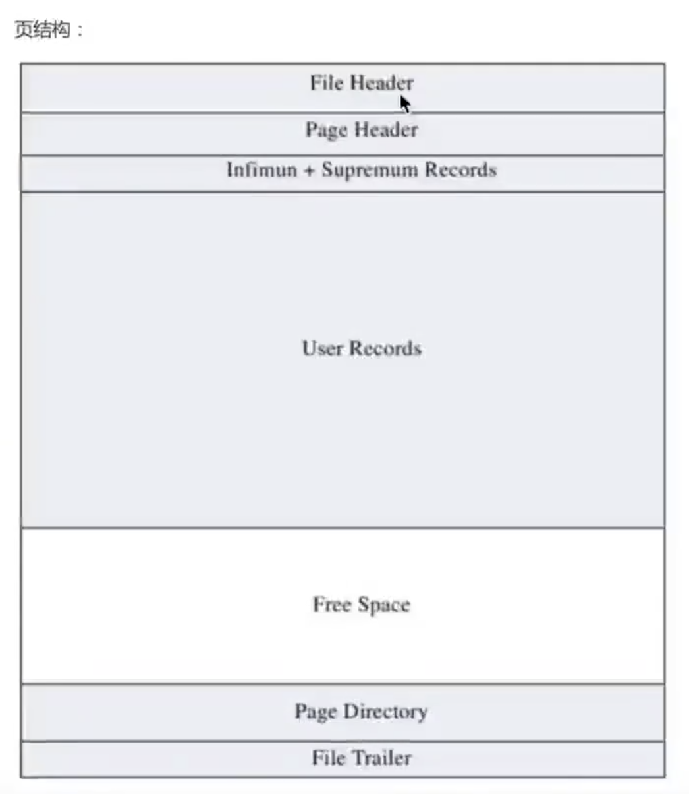
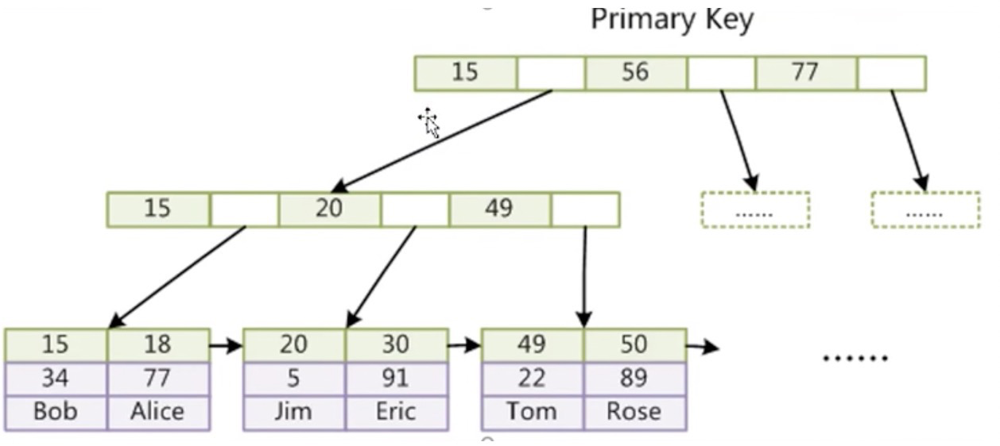

# MySQL
## 存储引擎

### 区别

| 对比     | MyISAM                                             | InnoDB                                                       |
| -------- | -------------------------------------------------- | ------------------------------------------------------------ |
| 主键     | 不支持                                             | 支持                                                         |
| 事务     | 不支持                                             | 支持                                                         |
| 行表锁   | 表锁，即时操作一条记录也会锁住整个表，不适合高并发 | 行锁，操作时，只锁某一行，不对其他行有影响，适合高并发操作。 |
| 缓存     | 只缓存索引，不缓存真实数据                         | 不仅缓存索引，还会存真实数据，对内存要求较高，而且内存大小对性能有决定性的影响 |
| 表空间   | 小                                                 | 大                                                           |
| 关注点   | 性能                                               | 事务                                                         |
| 默认安装 | Y                                                  | Y                                                            |

# MySQL
## InnoDB 页
MySQL 中一页是 16 KB。虽然一次可能只会读取一个数据，但是默认会加载局部一页的所有数据放到内存中去。


### 页目录与目录页
* 页目录是维护的页号，根据对应的查询条件，匹配到 数据 所在的页号；除了页号，在页号的上方还会维护一个当前页号内的数据 **主键最小** 的记录 id
* 目录页则是在一个页号中，根据当前页号内存储的记录形成的一个目录。
* 插入的时候生成了一颗 b+ 树，根据主键排序存储；如果没有主键，会去查看是否有唯一索引，如果唯一索引都没有，会自动生成一个 row_id; 如果主键不是自增的，那么可能会导致表的重新排列。而且主键不能过大，如果主键所占的空间过大，那么也就是说一页中能存储的索引数据就会减少。这样就会导致页变多，而页变多就会导致树高增加。
* 对于数据插入过多，之前的页保存不下的情况，mysql 选择将第一页复制一份，然后在开辟一个空的第二页，同时将原本的第一页改成目录页。这样启示页就不会改变。就可以将启示页加载到内存中去。
* b+ 树的优势：查询效率高；冗余；支持范围查询；树高较低 16kb/(8 + 6)
### 辅助索引
对除主键外的字段，比如另外三个字段bcd建立一个联合索引。与主键作为索引类似，联合索引也会生成一个 b+ 树，页目录为三个联合字段的值，对应的指针是页号，然后根据页号找到对应的页，找到联合主键作为索引的字段。但是叶子节点存储的上方为联合索引，下方存的数据位是索引值。

可以先通过辅助索引 + 主键回表进行查询 或者进行全表扫描。假如，极端条件下，根据索引选出了所有的记录，这样效率还不如全表扫描。

假如创建了一个辅助索引 bcd 然后使用 select  from b = 1 是可以使用这个索引的相当于 1** 进行查找。但是如果使用 c 则不行，因为 `*c*`是无法匹配到的。也就是最左前缀原则。如果左边的字符不给，是无法进行匹配的。因此，使用 like  %101% 也无法使用索引

`select * from t1 where b > 1 and c = 1` 不会使用索引，因为 c 无法进行匹配

* 因此，对于查询网址这种 如果 使用 like %com 是不会用到索引的，因此可以 like moc% 就可以使用到了索引

> 查询优化器 如果根据辅助索引选出的主键超过总数的80/90 那么查询优化器就会进行全表扫描。减小回表的开销。

## InnoDB 行格式
会限制一行的记录大小不能超过 65535 个字节，BLOB除外
### COMPACT 行格式
1. 变长字段长度列表(2字节)：由于变长字段中存储多少个字节是不确定的，所以存储真实数据时也会把这些变长的字段保存起来，COMPACT 格式中，会把变长字段占用的空间存放在记录开头位置，从而形成一个变长字段长度列表。
> MySQL 5.0.3 之后 varchar(20) 表示支持的字符，之前是字节

2. NULL标志(1字节)：COMPACT 行格式会把可以为NULL的列统一管理起来，存在一个标记为NULL值列表中，二进制 1 表示该列的值为NULL，为 0 表示不为 NULL
3. 记录头信息

## 事务隔离性
### Autocommit
1. 先开启一个事务
2. 再执行SQL
3. 然后再去将事务进行提交

### 隐式提交
1. 触发隐式提交，将会提前结束当前事务，其表现就仿佛是在当前行显示执行了“commit”指令。
2. DDL会触发隐式提交，如 alter create drop 等操作

### 保存点
1. `SAVEPOINT t1`，声明一个保存点
2. `rollback to t1` 
3. 很多时候进行回滚会丢弃到中间的操作，回到初始版本。但是加入保存点可以保证回滚到保存点。保留中间操作。

> `set session transaction isolation level xx`

### 读未提交 READ UNCOMMIT
1. 一个事务可以读到其他事务还没有提交的数据，会出现脏读

### 读已提交 READ COMMITTED
1. 一个事务只能读到已提交的事务修改的数据，并且其他事务对该数据进行一次操作并提交后，该事务都能查到最新值，会出现不可重复读，幻读
> 不可重复读：前一秒没有提交，得到一个数据；后一秒提交了，读取到了不同的数据。这种就是不可重复读 偏重于 update delete

2. 每一行会有隐藏的 transaction_id 用于记录上一个修改这条记录的 transaction
> 版本链 undolog 中
> 
> 对于使用 innoDB 存储引擎的表来说，他的聚集索引记录中包含两个隐藏的列
* trx_id:对某条记录修改时，都会把对应的事务id付给这个隐藏列
* roll_pointer:每次对某条记录进行修改时，这列都会隐藏一个指针，通过这个指针可以找到该记录修改前的信息

> ReadView
> 对于 READUNCOMMIT 隔离级别的事务来说，直接读取最新版本的就好了。对于READ COMMIT 和 REPEATABLE READ 而言，要决定版本链中哪个版本是当前事务可见的
1. m_ids 生成 ReadView 时当前系统中活跃的事务id<br />
2. min_trx_id m_ids 中的最小值 <br />
3. max_trx_id 表示ReadView应该分配给下一个事务的 id<br />
4. creator_trx_id 表示生成该事务的事务id

假如一个 A(100) 读到了最后一条记录， B(200) 将齐最后修改为 4，那么B的数据可以保存且完成读已提交，但是 A事务，简单的判断事务号是否相等，不可取。但是说到 ReadView 中的 m_ids 保存了当前活跃的事务，然后 A 事务发现了 200 这条事务不见了，说明 commit 了，那么就取 200 这个事务的结果

### 可重复读 REPEATABLE READ
1. 默认
2. 一个事务第一次读过了某条记录后，即使其他事务修改了该记录的值并提交，该事务再读这个记录时，读到的仍然是第一次读的值而不是每次都读到不同的数据
3. 这种隔离级别解决了不可重复读，但是没有解决幻读
4. 每次 检查 都会使用第一次 select 生成的 ReadView，这样认为所有的事务都没有提交，还是会选出第一次的读取的记录
> 幻读：如果一个事务先根据某些选择条件读出来一些记录，之后另一个事务又向这张表中插入一些满足这个条件的一些记录，原先的事务再次读取这张表，会把另一个事务插入的记录也读取出来，偏重于 insert


4. MySQL 的 可重复读 解决了幻读问题

### 串行化
1. 以上三种隔离级别允许并发操作，但是串行化只允许读读操作，因此是排队串行的操作。

### MVCC
* 多版本并发控制指的就是在使用 可重复读 和 读已提交这两种隔离级别的事务在执行普通 SELECT 操作时访问记录 版本链的过程。
* 可以使不同的事务读-写，写-读，从而提高并发行
* 可重复读和读已提交这两个隔离级别最大的不同就是生成 ReadView 的时机不同；读已提交会在**每次** SELECT 前生成一个 ReadView，而 可重复读 只会在**第一次**进行普通 SELECT 时生成 ReadView，然后每次都会重复使用这个 ReadView
* 支持高并发的读

## 锁
* 读锁：共享锁 S
* 写锁：排他锁 X
* select：不加锁

|      | X    | S      |
| ---- | ---- | ------ |
| X    | 冲突 | 冲突   |
| S    | 冲突 | 不冲突 |

1. 对于普通的 SELECT 语句不会，InnoDB 不会上锁
2. `select xx share in lock mode` 将查找到的数据上一个 S 锁，允许其他事务继续获取这些记录的 S 锁，但是不能获取 X 锁；适用于读取事务后，其他事务不能对这些记录进行修改，但是自己也不能修改，因为其他事务读取时也会加锁
3. `select for update` 上一个 X 锁，不允许其他事务获取这些记录的 X 锁与 S 锁；适用场景，读取后只能自己写

### 写操作
* DELETE 删除数据会先对这条记录加锁，再执行删除操作
* INSERT 插入一条记录时，会先加**隐式锁**来保护这条记录提交前不会被其他事务访问到。
* UPDATE  
    * 如果被更新的列，修改前后没有导致存储空间发生变化，那么会先给纪录加 X 锁，在对记录进行修改
    * 如果被更新的列，导致了存储空间发生了变化，那么会先给记录加 X 锁。然后将记录删除掉，再 insert 一条新数据
> 隐式锁：一个事务插入一条记录后，还未提交，这条记录会保存本次事务 id，其他事务如果想对这条记录加锁时，发现事务id记录不对应，这时会产生 X 锁，所以相当于在插一条记录时，隐式的给这条记录加了一把隐式 X 锁

### 行锁
### 间隙锁
锁定一个范围，并且锁定记录本身。对于行的查询，都是采用该方法。主要是为了解决幻读问题。
当查询没有走索引时，会对表中的所有记录以及间隙加锁
### 隔离级别下的锁
* 对于读已提交的隔离级别来说，将所有查出来的记录进行加锁。并且在上一个事务处理的间隔可以插入新数据。因此会产生幻读。
* 对于可重复读的隔离级别来说，为了防止幻读，会使用间隙锁。不使用索引的情况下，会锁住所有行以及间隙，不允许插入和update 操作，**注意，并不是表锁**

### 意向锁
* IS 锁：意向共享锁，每当事务准备在某条记录上加 S 锁时，需要先在表级别加入一个 IS 锁
* IX 锁：意向排他锁，每当事务准备在某条记录上加 X 锁时，需要先在表级别加入一个 IX 锁

> IS IX 是表级别锁，他们的提出是为了今后加表级别的写锁和读锁可以快速判断表中的记录是否被上锁，意向锁只会和表锁冲突

- **IX，IS是表级锁，不会和行级的X，S锁发生冲突。只会和表级的X，S发生冲突**
- 行级别的X和S按照普通的共享、排他规则即可。所以之前的示例中第2步不会冲突，只要写操作不是同一行，就不会发生冲突。

解决完这个疑问，再来回答意向锁的作用。意向锁是在添加行锁之前添加。

当再向一个表添加表级X锁的时候

- 如果没有意向锁的话，则需要遍历所有整个表判断是否有行锁的存在，以免发生冲突
- 如果有了意向锁，只需要判断该意向锁与即将添加的表级锁是否兼容即可。因为意向锁的存在代表了，有行级锁的存在或者即将有行级锁的存在。因而无需遍历整个表，即可获取结果

innoDB存储引擎实现了如下两种标准的行级锁：

1. 共享锁（S Lock）：允许事务读一行数据
2. 排他锁（X Lock）：允许事务删除或更新一行数据
   SS相互兼容：T1事务获取了r行的共享锁，那么T2事务也可以获取行r的共享锁

XX、XS、SX不兼容：

- T1事务获取了r行的共享锁，T2事务不能获取排他锁
- T1事务获取了r行的排他锁，T2事务不能获取共享锁或者排他锁

> select语句默认不会加任何锁类型，如果想加排他锁可以使用select for update；想加共享锁使用select lock in share mode
> update、delete、insert都会自动给涉及到的数据加上排他锁

需要注意的是，当给某一行增加共享锁、排他锁时，数据库会自动给这一行所处的表添加意向共享锁（IS Lock）、意向排他锁（IX Lock）也就是说：如果想给r行增加锁，需要给r行所在的表先增加意向排他锁。

下面来看一下意向锁的作用：
事务A锁住了表中的一行，让这一行只能读（数据库自动给该表增加意向共享锁），不能写。之后，事务B申请整个表的写锁。

step1：判断表是否已被其他事务用表锁锁表
step2：发现表上有意向共享锁，说明表中有些行被共享行锁锁住了，因此，事务B申请表的写锁会被阻塞。

如果没有意向锁则是这样的：
step1：判断表是否已被其他事务用表锁锁表
step2：判断表中的每一行是否已被行锁锁住。

## Join

### SQL 执行顺序
机器SQL解析：先读取 From 表，笛卡尔积（所有），然后 On 条件（主表保留），然后Join，选择条件，接着 GroupBy 和 Having，最后 SELECT ORDER By，LIMIT 选择展示的数据

* `select * from emp e inner join dept d on e.deptId = d.id` 内连接，选取交集
* `select * from emp e left join dept d on e.deptId = d.id` 左外连接，左全取
* `select * from emp e right join dept d on e.deptId = d.id` 右外连接，右全取
* `select * from emp e left join dept d on e.deptId = d.id where b.id is null` 只要左独有
* `select * from emp e right join dept d on e.deptId = d.id where e.deptId is null` 只要右独有
* `select * from emp e full outer join dept d on a.deptId = b.id` 左右全取，但是 MySQL 并不支持这种语法，Oracle 支持 只需要左外连接 union 右外连接
* 独有左 union 独有右

## 索引
### 定义
索引是一种数据结构，索引的目的在于提高查询效率。排好序的快速查找的数据结构。因此数据库除了数据本身外，还维护一个满足特定查找算法的数据结构，这些数据结构以某种方式指向数据，这样就可以在这些数据结构的基础上实现高级查找算法，这种数据结构是就是索引。

索引通常以文件的形式存储在磁盘上。索引提高了检索效率，降低了数据库的 IO 成本；而且进行排序后，降低了数据排序的成本，降低了 CPU 的消耗。但是索引也是一张表，保存主键和索引字段，并指向实体表的记录，因此索引会占据空间。虽然提高了查询速度，当时会降低表的更新速度，insert update 和 delete，每次需要更新索引。

### 索引分类
* 单值索引：一个索引只包含单个列，一个表可以有多个单列索引
* 唯一索引：索引列的值必须唯一，但是允许有空值
* 复合索引：一个索引包含多个列
* 基本语法：
    1. create [unique] index indexName on T(columnName(length)
       
       alter T add [unique] index [indexName] on (columnName(length)) 
    2. drop index [indexName] on T
    3. show index from table

### 创建索引的时机
1. 主键自动建立唯一索引
2. 频繁作为查询条件的子段应该创建索引
3. 查询中与其他表关联的字段，外间关系建立索引
4. 频繁更新的字段不适合创建索引
5. where条件里用不到的字段不创建索引
6. 查询排序的字段，排序字段若通过索引去访问将大大提升排序速度
7. 单键/组合索引的选择问题
8. 查询中统计或者分组字段

不创建索引
1. 表记录太少
2. 经常增删的表
3. 数据重复且分布平均的表字段

想要理解索引原理必须清楚一种数据结构「平衡树」(非二叉)，也就是b tree或者 b+ tree，重要的事情说三遍：“平衡树，平衡树，平衡树”。当然， 有的数据库也使用哈希桶作用索引的数据结构 ， 然而， 主流的RDBMS都是把平衡树当做数据表默认的索引数据结构的。

我们平时建表的时候都会为表加上主键， 在某些关系数据库中， 如果建表时不指定主键，数据库会拒绝建表的语句执行。 事实上， 一个加了主键的表，并不能被称之为「表」。一个没加主键的表，它的数据无结构的放置在磁盘存储器上，一行一行的排列的很整齐， 跟我认知中的「表」很接近。

如果给表上了主键，那么表在磁盘上的存储结构就由整齐排列的结构转变成了树状结构，也就是上面说的「平衡树」结构，换句话说，就是整个表就变成了一个索引。没错， 再说一遍， 整个表变成了一个索引，也就是所谓的「聚集索引」。 这就是为什么一个表只能有一个主键， 一个表只能有一个「聚集索引」，因为主键的作用就是把「表」的数据格式转换成「索引（平衡树）」的格式放置。


上图就是带有主键的表（聚集索引）的结构图。其中树的所有结点（底部除外）的数据都是由主键字段中的数据构成，也就是通常我们指定主键的id字段。最下面部分是真正表中的数据（数据页）。 假如我们执行一个SQL语句：

select * from table where id = 1256;

首先根据索引定位到1256这个值所在的叶结点，然后再通过叶结点取到id等于1256的数据行。 这里不讲解平衡树的运行细节， 但是从上图能看出，树一共有三层， 从根节点至叶节点只需要经过三次查找就能得到结果。如下图


假如一张表有一亿条数据 ，需要查找其中某一条数据，按照常规逻辑， 一条一条的去匹配的话， 最坏的情况下需要匹配一亿次才能得到结果，用大O标记法就是O(n)最坏时间复杂度，这是无法接受的，而且这一亿条数据显然不能一次性读入内存供程序使用， 因此， 这一亿次匹配在不经缓存优化的情况下就是一亿次IO开销，以现在磁盘的IO能力和CPU的运算能力， 有可能需要几个月才能得出结果 。如果把这张表转换成平衡树结构（一棵非常茂盛和节点非常多的树），假设这棵树有10层，那么只需要10次IO开销就能查找到所需要的数据， 速度以指数级别提升，用大O标记法就是O(log n)，n是记录总树，底数是树的分叉数，结果就是树的层次数。换言之，查找次数是以树的分叉数为底，记录总数的对数，用公式来表示就是


用程序来表示就是Math.Log(100000000,10)，100000000是记录数，10是树的分叉数（真实环境下分叉数远不止10）， 结果就是查找次数，这里的结果从亿降到了个位数。因此，利用索引会使数据库查询有惊人的性能提升。

然而， 事物都是有两面的， 索引能让数据库查询数据的速度上升， 而使写入数据的速度下降，原因很简单的， 因为平衡树这个结构必须一直维持在一个正确的状态， 增删改数据都会改变平衡树各节点中的索引数据内容，破坏树结构， 因此，在每次数据改变时， DBMS必须去重新梳理树（索引）的结构以确保它的正确，这会带来不小的性能开销，也就是为什么索引会给查询以外的操作带来副作用的原因。

讲完聚集索引 ， 接下来聊一下非聚集索引， 也就是我们平时经常提起和使用的常规索引。

非聚集索引和聚集索引一样， 同样是采用平衡树作为索引的数据结构。索引树结构中各节点的值来自于表中的索引字段， 假如给user表的name字段加上索引 ， 那么索引就是由name字段中的值构成，在数据改变时， DBMS需要一直维护索引结构的正确性。如果给表中加多个索引 ， 那么就会出现多个独立的索引结构，每个索引（非聚集索引）互相之间不存在关联。 如下图：


每次给字段建一个新索引， 字段中的数据就会被复制一份出来， 用于生成索引。 因此， 给表添加索引，会增加表的体积， 占用磁盘存储空间。

非聚集索引和聚集索引的区别在于， 通过聚集索引可以查到需要查找的数据， 而通过非聚集索引可以查到记录对应的主键值 ， 再使用主键的值通过聚集索引查找到需要的数据（即回表，可使用覆盖索引避免回表），如下图


不管以任何方式查询表， 最终都会利用主键通过聚集索引来定位到数据， 聚集索引（主键）是通往真实数据所在的唯一路径。

然而， 有一种例外可以不使用聚集索引就能查询出所需要的数据， 这种非主流的方法 称之为「覆盖索引」查询， 也就是平时所说的复合索引或者多字段索引查询。 文章上面的内容已经指出， 当为字段建立索引以后， 字段中的内容会被同步到索引之中 ， 如果为一个索引指定两个（多个）字段， 那么这个两个字段的内容都会被同步至索引之中。

A. 先看下面这个SQL语句

//建立索引

create index index_birthday on user_info(birthday);

//查询生日在1991年11月1日出生用户的用户名

select user_name from user_info where birthday = '1991-11-1'

这句SQL语句的执行过程如下

首先，通过非聚集索引index_birthday查找birthday等于1991-11-1的所有记录的主键ID值

然后，通过得到的主键ID值执行聚集索引查找，找到主键ID值对就的真实数据（数据行）存储的位置

最后， 从得到的真实数据中取得user_name字段的值返回， 也就是取得最终的结果

B. 我们把birthday字段上的索引改成双字段的覆盖索引

create index index_birthday_and_user_name on user_info(birthday, user_name);

这句SQL语句的执行过程就会变为

通过非聚集索引index_birthday_and_user_name查找birthday等于1991-11-1的叶节点的内容，然而， 叶节点中除了有user_name表主键ID的值以外， user_name字段的值也在里面， 因此不需要通过主键ID值的查找数据行的真实所在， 直接取得叶节点中user_name的值返回即可。 通过这种覆盖索引直接查找的方式， 可以省略不使用覆盖索引查找的后面两个步骤， 大大的提高了查询性能，聚集索引实际上就是一个全覆盖索引, 如下图


二叉树不适合作为索引的数据结构，极端情况下会蜕变成为一个链表。

红黑二叉树在大数据场景下导致树高度较高，查询叶子结点也会较慢。可以用非二叉的B树。

MySQL底层使用B+树->非叶子结点不存储data，只存储索引，可以放置更多的索引；叶子结点包含所有索引字段；叶子结点用指针连接，提高区间访问性能

MySQL 默认的结点为 16Kb -> 为什么设置为 16Kb：只存索引元素，而不存储数据，这样就可以存储更多的索引；主键假如使用bigint，bigint使用 8 bytes(64 bits )

索引 + 地址指针 构成一个大结点：假如使用bigint 8B + 地址指针6B = 14 B，而整个结点是16KB， 16KB/14B = 1170


存储引擎一般是用来形容表的。

MyISAM索引文件和数据文件是分离的(非聚集)->生成三个文件 .frm(frame) .MYI(indx) .MYD(data)


InnoDB:表数据文件本身就是按 B+ Tree 组织的一个索引结构文件；聚集索引-叶结点包含了完整的数据信息；->两个文件 .frm(frame) .ibd()

思考： 为什么InnoDB表必须有主键，并且使用整型的自增主键：比较速度快，占用内存小，自增不会导致树的平衡性被破坏，调整的开销很大。

​    为什么非主键索引结构叶子节点存储的是主键值（一致性和节省存储空间）



传统情况下，Hash并不能支持范围查找，因此，在叶子结点使用一个链表，可以定位并支持范围查找。

联合索引：

底层数据结构：索引最左前缀原理：排序规则，按照字段逐个比较


### 性能分析
MySQL 中有专门负责优化 SELECT 语句的优化器模型，主要功能是通过计算分析系统中的统计分析，优化检索

#### Explain
* explain + SQL: `explain select * from T`

```
+--+-------------|-------|------|---------------|-----|---------|-----|-----|--------|
|id| select_type | table | type | possible_keys | key | key_len | ref | row | extras |
+--+-------------|-------|------|---------------|-----|---------|-----|-----|--------|
```
1. id: 表的读取顺序
    * id 相同，执行顺序由上至下
    * id 不同，如果是子查询，id的序号会增加，id值越大，优先级越高，越先被执行
    * 使用虚表会出现id相同和不同的同时存在，那么就会先执行 id 大的，然后再id相同的顺序执行
2. select_type：数据读取操作的操作类型
    * SIMPLE
    * PRIMARY：最外层
    * SUBEQUERY
    * DERIVED：临时表
    * UNION：第二个 SELECT 出现在 UNION 中
    * UNION RESULT：从 UNION 集中取结果
3. type：最好到最差 system>const>eq_ref>ref>range>index>ALL
    * system: 表只有一行记录，等于系统表，这是 const 类型的特例，几乎不会出现。
    * const: 表示通过索引一次就找到了，const用于比较 primary key 或者 unique 索引，**因为只匹配一条记录**，所以很快就将该查询变为一个常量。
    * eq_ref: 唯一性索引扫描，对于每个索引键，表中只有一条记录与之匹配，常见于主键或者唯一索引扫描。
    * ref: 非唯一性索引扫描，返回匹配某个单独值的所有航。本质上也是一种索引访问，它返回所有匹配某个单独值的行，然而，可能会找到多个符合条件的行。
    * range: 只检索给定范围的行，使用一个索引来选择行，key列显示使用了哪个索引，一般这种就是在你的 where 语句中出现了 between, <>, in 等查询。这种范围扫描索引比全表扫描要好，因为他只需要开始于索引的某一点，而结束于另一点，不用扫描全部索引。
    * index: Full index scan， index 类型只遍历索引树，比ALL块，因为索引文件通常比数据文件小
    * ALL: 全表扫描
    
4. possible_keys: 显示可能应用在这张表中的索引，一个或多个。查询涉及到的字段上若存在索引，则该索引将被列出，**但不一定被查询实际使用**
5. key：实际使用的索引，如果为NUll 则没有使用索引；若查询中使用了覆盖索引，则该索引仅出现在 key 列表中。关注key的情况。
6. key_len: 表示索引中使用的字节数，可通过该列计算查询中使用的索引长度，在不损失精度的情况下， 长度越短越好。key_len 显示的值为索引字段的最大可能长度，并非实际使用长度。即 key_keb 是根据表定义计算而得，不是通过表内检索出来的。（同样的结果，使用的长度越短越好）
7. ref: 显示索引的哪一列被使用了，如果可能的话，是一个常量，哪些列或常量被用于查找索引

8. rows: 根据表统计信息及索引选用情况，大致估算处找到所需的记录所需要读取的行数。
9. extra：
    * Using filesort: 说明 mysql 会对数据使用一个外部的索引排序，而不是按照表内的索引顺序进行读取。MySQL中无法利用索引完成的排序操作称为文件排序。使用的 order by 没有按照索引排序。
    * Using temporary: 使用临时表保存中间结果，MySQL 在对查询结果排序时使用临时表。常见于 order by 和分组查询 group by，因此 索引一定要和 groupby 一致，否则很容易出现以上两个字段
    * Using index：表示相应的 select 操作使用了 覆盖索引，避免了访问表的数据行，效率好。如果同时出现 using where 表明了索引被用来执行索引键值的查找；如果没有同时出现 using where 表明索引用来读取数据而非执行查找动作。
    > **覆盖索引** select 的数据列只用从索引中就能取得，不必读取数据行，MySQL 可以利用索引返回 select 列表中的字段，而不必根据索引再次读取数据文件，换句话说，查询的列要被所建的索引覆盖。

    * using join buffer
    * impossible where
    * distinct
    * select tables optimied away
    
## 锁机制

### 表锁：
偏向 MyISAM 存储引擎，开销小，加锁块；无死锁；锁定粒度大，发生锁冲突的概率最高，并发度最低。
表共享读锁、独占写锁
| 锁类型 | 可否兼容 | 读锁 | 写锁 |
| ------ | -------- | ---- | ---- |
| 读锁   | 是       | 是   | 否   |
| 写锁   | 是       | 否   | 否   |

因此，对 MyISAM 表的读操作，不会阻塞其他进程对同一张表的读请求，但会阻塞对同一表的写请求。只有当读锁释放后，才会执行其他进程的写操作。写操作，会阻塞其他进程对同一表的读和写操作，只有当写锁释放后，才会执行其他进程的读写操作。

此外 MyISAM 的读写锁调度是写优先，这也是 MyISAM 不适合做写为主表的引擎，因为写锁后，其他线程不能做任何操作，大量的更新会使查询很难得到锁，从而造成永远阻塞。

### 行锁
偏向 InnoDB 存储引擎，开销大，加锁慢；会出现死锁；锁粒度最小，发生冲突的概率最低，并发度也高
> InnoDB 与 MyISAM 最大的不同有两点，一是支持事务；而是采用了行级锁

#### 无索引行锁升级为表锁
varchar 必须加单引号，如果不加，虽然会帮助自动类型转换，但是转换后导致索引失效
，此时其他想要访问这张表的其他行，就会被阻塞。

#### 间隙锁的危害
当我们使用范围条件而不是相等条件检索数据，并请求共享或者排他锁时，InnoDB 会给符合条件的已有数据记录的索引项加锁；对于键值在条件范围内但并不存在的记录，叫做 GAP，InnoDB 也会对这个间隙加锁，这种锁机制就是所谓的间隙锁

危害：因为 Query 执行过程中通过范围查找的话，会锁定整个范围内所有的索引键值，即使这个键值并不存在。间隙锁有一个比较致命的弱点，就是当锁定一个范围键值后，即使某些不存在的键值也会被无辜锁定，而造成在锁定的时候无法插入锁定键值范围内的任何数据。

### 总结： 
InnoDB 存储引擎由于实现了行级锁定，虽然在锁定机制的实现方面所带来的性能损耗可能比表级锁定会更要高一些， 但是在整体并发处理能力方面要远远优于 MyISAM 的表级锁定，当系统并发量较高的时候，InnoDB 的整体性能和 MyISAM 相比就会有比较明显的优势

但是，InnoDB 的行级锁定同样也有脆弱的一面，使用不当，可能让 InnoDB 的整体性能表现不如 MyISAM 高。

优化建议：
1. 尽可能让所有数据检索都通过索引完成，避免无索引行锁升级为表锁
2. 合理设计索引，尽量减小锁的范围
3. 尽可能较少检索条件，避免间隙锁
4. 尽量控制事务大小，减小锁定资源量和事件长度
5. 尽可能降低事务隔离级别。

Innodb_row_lock_waits：系统从启动后到现在总共等待的次数

Innodb_row_lock_current_waites:当前正在等待锁定的数量。

### 页锁
开销和加锁时间界于表锁和行锁之间；会出现死锁；锁定粒度界于表锁和行锁之间，并发度一般。

## 主从复制
### 基本原理
slave 会从 master 读取 binlog 来进行数据同步

### 步骤

1. master 将改变记录到二进制日志(binary log) 这些记录过程叫做二进制日志事件，binary log events
2. slave 将 master 的binary log events 拷贝到他的中继日志(relay log)
3. slave 重做中继日志中的事件，将改变应用到自己的数据库中，MySQL复制是异步且串行化的

主库有一个log dump线程，将binlog传给从库
从库有两个线程，一个I/O线程，一个SQL线程，I/O线程读取主库传过来的binlog内容并写入到relay log,SQL线程从relay log里面读取内容，写入从库的数据库。

审计：用户可以通过二进制日志中的信息来进行审计，判断是否有对数据库进行注入攻击。

#### 基本规则
1. 每个 slave 只有一个 master
2. 每个 slave 只能有一个唯一的服务器 ID
3. 每个 master 可以有多个 slave

#### 复制最大问题
延迟。

#### 一主一从常见配置
1. MySQL 版本一致且后台以服务运行
2. 主从配置都在[mysqld]节点下，都是小写
3. 主机修改 my.ini 配置文件
    * [必须]主服务器唯一ID
    * [必须]启用二进制日志 log-bin=自己本地路径/mysqlbin
    * [可选]启用错误日志 log-err=自己本地路径/mysqlbin
    * [可选]根目录 basedir
    * [可选]临时目录 tmpdir
    * [可选]数据目录 datadir
    * read-only = 0 主机读写都可以
    * [可选]设置不要复制的数据库 binlog-ignore-db=mysql 不复制自带的数据库
    * [可选]设置需要复制的数据库
4. 从机修改 my.ini 配置文件
    * [必须]从服务器唯一 ID
    * [可选]启用二进制日志
5. 重启主从服务器的 MySQL 服务，主从关闭防火墙 service iptables stop
6. 主机建立账户并授权 slave `grant replications slave on *.* to 'root'@'127.0.0.1' indentified by 'pass'; flush priviledges;`
7. 查询 master 状态 `show master status` Position会指定复制的文件的位置
8. 从机上配置 `change master to master_host='127.0.0.1', master_user='root', master_password='pass' master_log_file='mysqlbin.000012', master_log_pos=4386;`
9. 启动 slave `start slave; show slave status` 停止 从机 stop slave;

