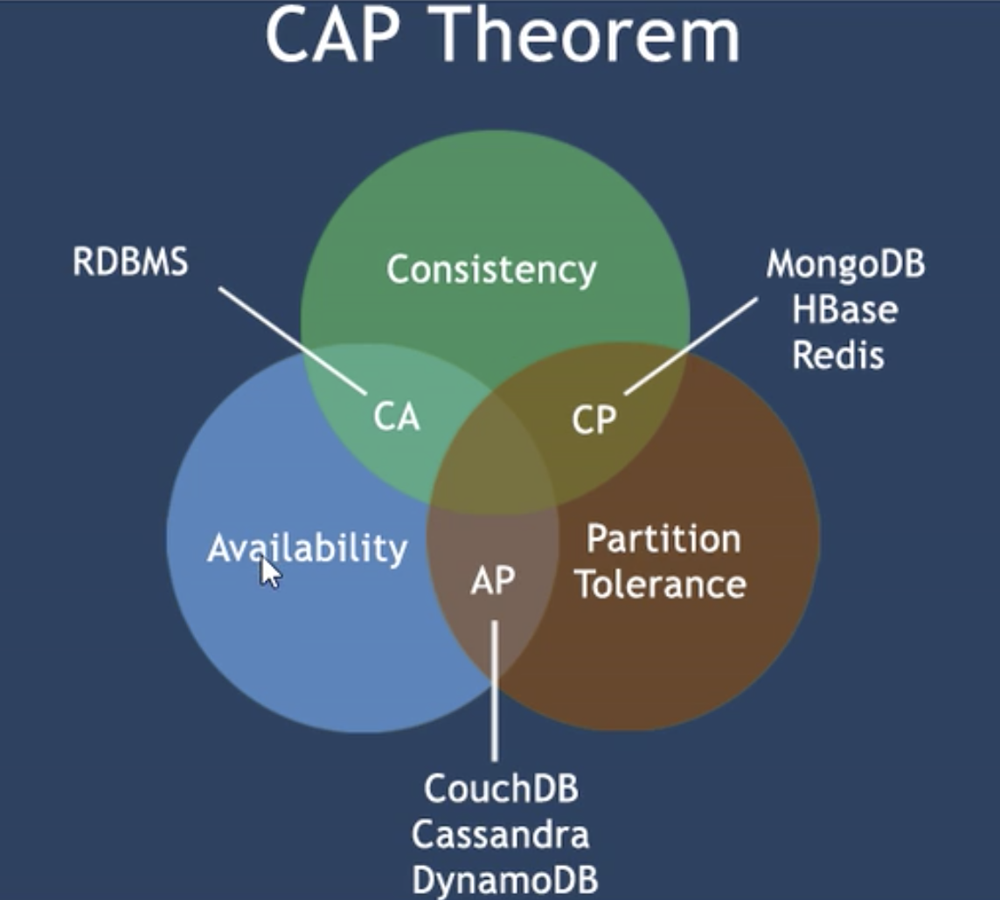
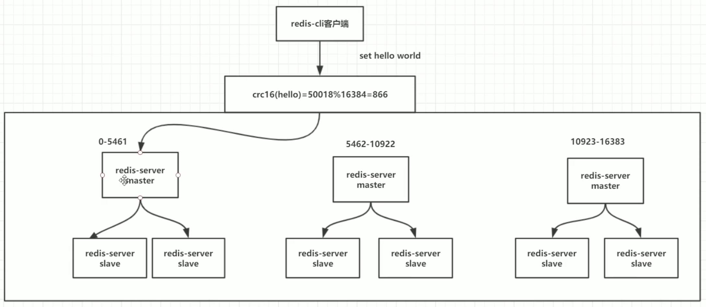

# NoSQL
## 原理
排队，redis 是单线程的，一次只处理一个请求。因此没有并发问题。

RDB 会先将数据写入到一个临时文件，待持久化结束，再用这个临时文件替换上次的持久化文件。RDB 在 shutdown 时，如果没有开启 aof，会触发配置文件中的默认快照配置。执行 save(只管保存，其他全部阻塞) 或者 bgsave(会在后台异步进行，同时可以响应客户端的请求)

AOF 默认关闭，不断的进行重写。auto-aof-rewrite-percentage 100 超过原文件大小的100% 或者超过默认的64M

通过 aof-use-rdb-preamble 配置参数控制，混合持久化是通过 bgrewriteaof 完成的，不同的是当开启混合持久化时，fork出的子进程先将共享的内存以RDB方式写入aof文件，然后将重写缓冲区的增量命令以AOF的方法写入到文件，写入完成后通知统计信息，并将新的含有RDB格式和AOF格式的AOF文件替换旧的AOF。也就是说，新的 APOF 文件的前半部分是 RDB 格式的全量数据后半段是 AOF 格式的增量数据。

RDB 适合大规模的数据恢复，对数据的完整性和一致性要求不高。混合持久化建议 RDB 保留 900 1 即可。AOF 消耗高，数据丢失的小。

## CAP + BASE
### 传统的ACID
1. Atomicity 原子性
2. Consistency 一致性
3. Isolation 独立性
4. Durability 持久性

### CAP
1. Consistency 强一致性
2. Availability 可用性
3. Partition tolerance 分区容错性

> 一个分布式系统不可能同时很好的满足一致性，可用性和分区容错性这三个需求，最好只能较好的满足 2 个。

#### CAP 的三进二
* CA 单点集群，满足一致性，可用性的系统，通常子啊可扩展性不太强 - 传统Oracle
* CP 满足一致性，分区容忍的系统，通常性能不是很高 - Redis Mongodb
* AP 满足可用性，分区容忍性的系统，通常可能对一致性要求低一些 - 大多数网站架构的选择，可以牺牲一些浏览数这种强一致性，因此若一致性+AP是最好的电商选择


#### BASE
* Basically Available 基本可用
* Soft state 软状态
* Eventually consistent 最终一致

他的思想是通过让系统放松对某一时刻**数据一致性的要求**来换取系统整体伸缩性和性能的改观。使用这个 BASE 思想到达最终一致性。

## Reids
### 特点
1. 支持数据的持久化，可以将内存中的数据保持在磁盘中，重启的时候可以再次加载使用
2. Redis不仅仅支持简单的 key-value 类型的数据，同时还提供 list set zset hash等数据结构的存储
3. Reids 支持数据的备份，即 master-slave 模式的数据备份

### 功能
1. 内存存储和持久化：redis 支持异步将内存中的数据写到硬盘，同时不影响继续服务
2. 取最新 N 个数据的操作
3. 模拟类似 HttpSession 这种需要设定过期时间的功能
4. 发布、定于消息系统
5. 定时器、计数器

### 知识点
1. 单进程
    * 单进程模型来处理客户端的请求，对读写等事件的响应
    * 通过对 epoll 函数的包装来做到，Redis 的实际处理速度完全依靠主进程的执行效率
    * Epoll 是 linux 内核作为大批量文件描述符而作了改进的 epoll，是 Linux 下多路复用 IO 接口 select/poll 的增强版本，他能显著提高程序在大量并发连接中只有少量活跃的情况下的系统 CPU 利用率
2. 默认装载 16 个库
3. SELECT 命令切换数据库
4. dbsize 查看当前数据库的 key 的数量
5. flushdb 清空当前的数据库
6. flushall 通杀全部库
7. redis 索引都是从零开始
8. 默认端口 6379 (merz)
9. 统一密码管理，16个库都是同样的密码，要么都 OK 要么一个也连不上

### 五大数据类型
1. string: 最基本的类型，一个 key 对应一个 value, string类型是二进制安全的，redis的 string 可以包含任何数据，jpg或者序列化对象，value 最多可以是 512M
2. hash: 一个键值对集合，string类型的 field 和 value 的映射表，hash 特别适合用于存储对象
3. list: list 是一个简单的字符串列表，按照插入顺序排序，底层是一个链表。
4. set: string 类型的无需集合，通过HashTable实现
5. zset(sorted set): 有序集合，每个元素都会关联一个 double 类型的分数。zset的成员是唯一的，但是分数(score)却可以重复

### Key 操作
1. keys *
2. exists keyName 判断key是否存在
3. move key db 从当前库剪切到指定 db
4. expire key 秒钟：指定 key 的过期时间
5. ttl key 查看还有多少秒过期 -1表示永不过期，-2 表示已过期;已过期就会从内存中移除，
6. type key 查看 key 的类型

#### String
常用，单值单 value

* set/get/del/append/strlen
* incr(一次 + 1)/decr/incrby(本身 + 指定的数)/decrby, **一定要是数字才能进行加减**
* getrange(between and, 0到-1表全部)/setrange(范围内赋值，替换)
* setex(set with expire)键秒值/setnx(set if not exist): setex key seconds value
* mset/mget/msetnx: `mset k1 v1 k2 v2 k3 v3`，如果有一个是不成功，整条就失效，比如存在 k3 还使用 msetnx k3 1 k4 v4,就不会插入成功
* getset(先 get 再 set)

#### List
单值多 value，对于头尾的操作效率高，但是对中间元素进行操作，效率较低
* lpush/rpush/lrange: `lpush list01 1 2 3 4 5` `lrange list01 0 -1`类似于栈的操作
* lpop/rpop: 按照栈的出队，一次一个
* lindex 按照索引下标获得元素
* llen
* lrem key 删除 N 个 value
* ltrim key startIndex endIndex，截取指定范围的值后再赋给 key，类似于字符串
* rpoplpush src des 从源的最下方出栈，目的的上方入栈
* lset key index value 设置指定位置的指定值
* linsert key before/after val1 val2 在指定 key 的前后插入新值

#### Set
单值多value
* sadd/smembers/sismember 添加，再添加重复的就不会加入进去；查看所有；元素是否在集合中
* scard 获取集合里面的元素个数
* srem key value 删除集合中元素
* srandmember key 某个整数随机出几个数
* spop key 随机出栈
* smove key1 key2 在 key1 里某个值，作用是将 key1 里的某个值赋给 key2
* 数学集合：
    * 差集：sdiff 在第一个set里，但不在第二个set中的元素
    * 交集：sinter
    * 并集：sunion

#### Hash
KV模式不变，但是 V 是一个键值对
* hset/hget/hmset/hmget/hgetall/hdel: `hmset user id 1 name z3 age 16` 全取 `hgetall`
* hlen
* hexists key 在 key 里面的某个值的 key
* hkey/hvals
* hincrby/hincrbyfloat 分别加整数和小数
* hsetnx

#### zset：
在 set 基础上，加一个 score 值，之前 set 是 k1 v1 v2，现在是k1 score1 v1 score2 v2
* zadd/zrange (withsorces): zset01 60 v1 70 v2 80 v3
* zrangebyscore key startScore endScore withscores/( 不包含/limit
* zrem key作用是删除元素 `zrem zset01 v5`
* zcard/zcount key score 区间/zrank key values 值，作用是获得下标值/zscore key 对应值，获得分数
* zrevrank key values 值，逆序获取val下标值
* zrevrange 逆序获取 key 下标值
* zrevrangebyscore

### 配置文件
1. 配置大小单位，开头定义了一些基本的度量单位，支持bytes不支持bit且对大小写不敏感
2. includes: 可以包含其他 redis 的配置文件
3. General: 
    * 开启守护进程 daemonize；
    * 指定 pidfile；
    * tcp-backlog 设置 tcp 的 backlog，backlog是一个连接队列，backlog队列总和 = 未完成三次握手队列 + 已完成三次握手队列，在高并发的环境下，需要一个高 backlog 值来避免慢客户端连接问题。
    * timeout 0 空闲指定秒数就关闭连接
    * tcp-keepalive 单位为秒，如果设置为 0 则不会进行 keepalive 检测，建议设置为 60
    * loglevel 指定日志级别 四个级别 debug verbose notice warning 最后两个是生产系统
    * logfile
    * 默认 syslog 是关闭的 syslog-ident 指定日志标志 指定 sysylog-facility
    * 默认 16 个库
4. SNAPSHOTTING 快照
5. REPLICATION 复制
6. SECURITY 安全 `config get requirepass`
7. LIMITS
    * maxclients：设置同一时间最大客户端连接数，默认无限制
    * maxmemory：最大内存限制，达到最大内存后 redis 会尝试清除 key
    * maxmemory-policy: 
        * Volatile-lru 基于LRU算法，根据过期时间移除key，只针对设置了过期时间的key
        * allkeys-lru 根据LRU算法移除key
        * volatile-random 随机删除过期集合中的 key，只针对设置了过期时间的
        * allkey-random 随机删除一个 key
        * vilatile-ttl 移除那些 TTL 值最小的 key，即那些要过期的 key
        * noeviction 不进行移除，针对写操作，返回错误信息。
    * maxmemory-samples：设置样本的数量，LRU 算法和最小TTL算法都并非是精确的算法，而是估值算法，所以可以设置样本的大小，redis默认会检查这么多个key并选择LRU哪个。
    
### 持久化
#### rdb
在指定的时间间隔内，将内存中的数据集快照写入磁盘，也就是 Snapshot 快照，它恢复时是将快照文件直接读到内存中。

##### Redis 会单独创建(fork)

一个子进程来进行持久化，会将数据写入到一个临时文件中，待持久化过程结束了，再用这个临时文件替换上次持久化好的文件。整个过程，主进程不进行任何 IO 操作，这就确保了极高的性能。如果需要进行大规模数据的恢复，且对于数据恢复的完整性不是特别敏感(精度不高)，那么RDB方式要比AOF方式更加的高效。RDB的缺点是最后一次持久化后的数据可能会丢失。

fork的作用是复制一个与当前进程一样的进程，新进程的所有数据(变量、环境变量、程序计数器等)，数值都和原进程一份，但是是一个全新的进程，并作为原进程的子进程

> rdb 保存的是 dump.rdb 文件，分布式的内存数据库。
>
> >save seconds changes: 默认15 min以内有一个 key 被改变、5min以内 10 个 key 被改动、60s 10000个 key 被改 就会触发 RDB，重启后，会将 rdb 文件读回到内存

执行 flushall 和 flush shutdown 等操作会类似于 commit，提交事务并保存 rdb 文件

##### SNAPSHOTTING 配置：

1. save seconds changes
2. 禁用生成快照可以在配置文件中不设置任何 save 命令或者在命令行 save，即可立即进行持久化。
3. stop-writes-on-bgsave-error: 默认 yes，后台 save 出错，前面要停止 write 操作
4. rdbcompression: 对于存储到磁盘中的快照，可以设置是否进行压缩存储，如果是的话，redis会采用 LZF 算法进行压缩。如果不想消耗 CPU 来进行压缩的话，可以设置为关闭。
5. rdbchecksum: 存储快照后，可以让 redis 使用 CRC64算法来进行数据校验，但这样做会增加大约 10% 的性能消耗
6. dbfilename:
7. dir:

##### 如何触发 RDB 快照

1. 配置文件中默认的快照，配置冷拷贝后使用
2. 命令 save 或者 bgsave：save 只管保存，其他全部阻塞；bgsave redis 会在后台异步进行快照操作，快照同时 户端的请求，可以通过 lastsave 命令获取最后一次成功执行快照的时间
3. 执行 flushall 命令也会产生dump.rdb 文件，但是空，无意义。

##### 如何恢复

将 dump.rdb 文件移动到 redis 安装目录并启动服务，可以通过 `config get dir` 获取目录

##### 优势与劣势
适合大规模的数据恢复，对数据完整性和一致性要求不高。可能丢失最近几分钟的数据。Fork的时候内存中的数据被克隆了一份，大致2倍的膨胀性需要考虑。

##### 总结：
* RDB 是一个非常紧凑的文件，数据丢失风险大，需要经常 fork 子进程来保存数据集到硬盘上。fork 可能会耗时，也有可能导致一些毫秒级不能响应请求
* 保存RDB文件时，父进程唯一需要做的就是 fork 出一个子进程，接下来的操作全部由子进程完成，父进程不需要在做其他 IO 的操作
* RDB的持久化方式可以最大化 redis 性能
* 与 AOF 相比，在恢复大的数据集时，RDB方式会更快一些。

#### aof
以日志的形式记录每个写操作，将Redis执行过的所有写指令记录下来(度操作不记录)，只可以追加文件但不可以改写文件，redis启动之初会读取该文件重新构建数据，换言之，redis重启的话就根据日志文件的内容将写指令从前到后执行一次以完成数据的恢复

appendonly 会忠实的记录每个操作，哪怕 flushall；RDB 和 AOF 共存时，先找 AOF 文件，当有写操作出现异常时(断电)，启动 reids 操作也会失败。出错后使用 `redis-check-aof --fix appendonly.aof`

##### 配置文件
1. appendonly yes
2. appendfilename
3. appendsync
    * always 同步持久化，每次发生数据变更会被立即记录到磁盘，但是性能较差但数据完整性比较好。
    * everysec 出厂默认推荐，异步操作，每秒记录，如果一次内宕机，有数据丢失
    * no
4. no-appendfsync-on-rewrite 重写时是否可以用 appendsync 默认 no 保证安全性
5. auto-aof-rewrite-min-size 设置重写的基准值
6. auto-aof-rewrite-percentage: 设置重写的基准值

##### AOF 修复
1. 正常恢复
2. 异常恢复 启动；备份被写坏的 AOF 文件；修复 redis-check-aof --fix;重新加载

##### Rewrite
aof 越来越大，需要优化精简；因此新增了重写机制，当超过了一定的阈值，就会启动 aof 文件的内容压缩，只保留可以恢复数据的最小指令集，可以使用命令 bgrewriteaof

原理：AOF 稳健持续增长而过大时，会 fork 出一条新进程来将文件重写(也是先写临时文件，最后再 rename)，遍历新进程的内存中数据，每条记录有一条的 set 语句。重写 aof 文件的操作时，并没有读取旧的 aof 文件，而是将整个内存中的数据库内容用命令的方式重写的了一个新的 aof 文件，这点和快照类似。

触发机制：默认配置是当 aof 文件大小是上次 rewrite 后大小的一倍且文件大于 64M 时触发

##### 优势与劣势
1. 优势：每秒同步；每修改同步；不同步
2. 劣势：相同数据集的数据而言 aof 文件要远大于 rdb文件，恢复速度慢于 rdb；aof 运行效率要慢于 rdb 每秒同步策略效率较好，不同步效率和 rdb 相同

##### 小结

1. AOF 文件是一个只进行追加的日志文件，Redis 可以在 AOF 文件体积变得过大时，自动的在后台对 AOF进行重写
2. AOF 文件有序的保护了对数据库执行的所有写入操作，这些写入操作以 redis 协议的格式保存
3. 对于相同的数据集来说，AOF 文件的提及通常大于 RDB 文件
4. 根据所使用的 fsync 策略，AOF 的速度可能会慢于 RDB

#### 总结
RDB 持久化方式能够在指定的时间间隔对数据进行快照存储，AOF持久化方式记录每次对服务器写的操作，当服务器重启时重新执行这些命令恢复原始数据，AOF 命令以 redis 协议追加保存每次写的操作到文件末尾，redis还能对 AOF 文件进行后台重写

只做缓存：如果只希望数据在服务器运行的时候存在，也可以不适用任何持久化方法

同时开启：在这种情况下，服务器重启也会只招 AOF 文件，但是不能单纯的使用 AOF，因为 RDB 更适合用于备份数据库，快速重启，而且不会有 AOF 潜在的 bug

性能建议：因为 RDB 文件只用作后备用途，建议只在 Slave 上持久化 RDB 文件，而且只要 15分钟备份一次，只保留 save 900 1 这条规则

如果 enable aof 好处是在恶劣情况下也只会丢失不超过两秒数据，启动脚本较简单只load 自己的 AOF 文件就可以了，代价一是带来了持续 IO 二是 AOF rewrite 的最后将 rewrite 过程中产生的新数据写到新文件造成的阻塞几乎是不可避免的。只要硬盘许可，应该尽量减少 AOF rewrite 的频率，AOF 重写的基础大小默认值 64M 太小了，可以设到 5G

如果不 enable AOF 仅依靠 主从复制也可以实现高可用性。可以节省 IO 减少 rewrite 时带来的系统波动。代价是如果 master/slave 同时 宕机，会丢失十几分钟数据，启动脚本也要比较两个 master/slave 中的 rdb 文件，载入较新的那个。

### 事务
可以一次执行多个命令，本质是一组命令的集合，一个事务中的命令都会序列化，按顺序的串行执行而不会被其他指令插入，不许加塞。

一个队列中，一次性、顺序性、排他性的执行一系列命令

#### 常用命令
1. discard: 取消事务，放弃执行
2. exec: 执行所有事务块内的命令
3. multi:标记一个事务块的开始
4. unwatch: 取消 watch 命令对所欲 key 的监视
5. watch key: 监视一个或多个 key，如果在事务执行之前这个key 被其他命令所改动，那么事务会被取消
```redis
正常执行
> MULTI
OK
> set k1 v1
QUEUED
> set k2 v2
QUEUED
> EXEC
1) OK
2) OK

放弃事务
> MULTI
OK
> set k1 v1
QUEUED
> set k2 22
QUEUED
> DISCARD

全体连坐
> MULTI
OK
> set k1 v1
QUEUED
> set k2 v2
QUEUED
> getset k3  X
ERR 根本没有这个命令，因此直接全部撤销
> set k3 v3
QUEUED
> EXEC
全部执行不成功

找到错误的
> MULTI
OK
> incr k1 X
QUEUED
> set k2 22
QUEUED
> EXEC
1) ERR 有这个命令，但是执行不成功
2) OK

watch 监控
> MULTI
OK
> set k1 v1
QUEUED
> set k2 v2
QUEUED 

Watch 加锁
> WATCH balance
OK
> MULTI
OK
> decrby balance 20
QUEUED
> incrby debt 20
QUEUED
> EXEC
1) 80
2) 20
```

没有强一致性，部分支持，因为可以部分成功部分不成功

三个阶段：
1. 开启：MULTI 开始一个事务
2. 入队：将多个命令入队列到事务中，接到这些命令并不会立即执行，而是防盗等待执行的事务队列里面
3. 执行：由EXEC命令触发事务

三特性：
1. 单独的隔离状态：事务中的所有命令都会序列化、按顺序的执行。事务在执行过程中，不会被其他客户端发送来的命令请求所打断
2. 没有隔离级别的概念；队列中的命令没有提交之前都不会实际的被执行，因为事务提交前任何指令都不会被实际执行，也就不存在 事务内的查询要看到事务里的更新，在事务外的查询不能看到 这个问题
3. 不保证原子性：redis 同一个事务中如果有一条执行失败，后面的命令仍然会被执行，没有回滚

### 发布和订阅机制
进程间的一种消息通信模式：发送者 pub 发送消息；订阅者 sub 接受消息

### 主从复制
主机数据更新后根据配置和策略，自动同步到备机的 master/slave 机制，master 以写为主，slave 以读为主

1. 配从不配主
2. 从库配置：slaveof 主库IP 主库端口->每次与 master 断开之后，都需要重新连接，除非你配置进 redis.conf 文件；info replica
3. 修改配置文件细节操作
    * 拷贝多个 redis.conf 文件
    * 开启daemonize yes
    * pid文件名字: /var/run/redis6379.pid /var/run/redis6380.pid /var/run/redis6381.pid
    * 指定端口 6379 6380 6381
    * log文件名称 logfile "6379.log" logfile "6380.log" logfile "6381.log"
    * dump.rdb名字 dump6379.rdb dump6380.rdb dump6381.rdb
4. 常用三招：
    * 一主二仆: slave 节点不可以执行写操作；主机down，slave 节点的角色依旧是 slave；主机恢复，一切照旧；slave 节点down，重启变为 master，如果写入配置文件，就可以避免这种情况。
        ```
        > info replication
        初始时看到三台都是 master
            
        > slaveof 127.0.0.1 6379
        ```
        缺点是 中心化严重
    * 薪火相传：上一个 slave 可以是下一个 slave 的 master，slave 同样可以接收其他 slaves 的连接和同步请求，那么该 slave 作为了链条中下一个的 master，可以有效减轻 master 的写压力；中途变更转向会清除之前的数据，重新简历拷贝最新的
    > 接力续传；
    
    * 反客为主：slaveof no one，使当前数据库停止与其他数据库的同步，转成主数据库，可以让主机down，让 slave 节点成为 master；此时 原 master归来，
    
5. 复制原理：slave 启动成功连接到 master 后会发送一个 sync 命令，master 接到命令启动后台的存盘进程，同时收集所有接收到的用于修改数据集命令，在后台进程执行完毕之后，master将传送整个数据文件到 slave，完成第一次同步。
    1. 全量复制：slave服务在接收到数据库文件数据后，将其存盘并加载到内存中
    2. 增量复制：Master继续将新的所有收集到的修改命令依次传给 slave完成同步，但是只要是重新连接 master 一次完全同步(全量复制)将被自动执行
6. 哨兵模式：反客为主的自动版

    1. 调整结构 6379 + 6380｜6381
    2. 自定义的 /myredis 目录下新建 sentinel.conf 文件，名字固定
    3. 配置哨兵，填写内容：sentinel monitor 被监控数据库名字 127.0.0.1 6379 1
        
> 上面的最后一个数字 1，表示主机挂掉后 slave 投票看让谁接替成为主机，得票数多少后成为主机
        
    4. 启动哨兵 redis-sentinel /usr/local/bin/sentinel.conf 哨兵开始监控，此时master 断掉，slave接上；原master回来，变为 slave
    5. 投票选择
    6. 一组 sentinel 可以同时监控多个 master
    7. 复制缺点：复制延时，由于所有的写操作都是现在 master 上操作，然后同步更新到 slave 因此从master 同步到 slave 机器上有一定的延迟，当系统繁忙时，演吃会更加严重，slave 机器数量的增加也会使这个问题更加严重。选举和切换时并不能提供服务
    
## Redis 集群
类似于使用多组哨兵实现。


### 以上缺点
主从复制：复制是高可用 Redis 的基础，哨兵和集群都是在复制基础上实现高可用的。复制主要实现了数据的多级备份以及对于度操作的负载均衡和简单的故障恢复。缺陷是故障恢复无法自动化；写操作无法负载均衡；存储能力受到单机的限制。

哨兵：在复制的基础上，哨兵实现了自动化的故障恢复。缺陷是写操作无法负载均衡，存储能力受到单机的限制

集群：通过集群，Reids 解决了写操作无法负载均衡，以及**存储能力**受到了单机限制的问题，实现了较为完善的**高可用**方案。  

### 配置
1. 手动修改配置文件
```
cluster-enabled yes
cluster-config-file nodes-7000.conf
剩下的注释全给取消掉。
```
2. meet
> cluster meet ip port
3. 指派槽位
查看 crc16 算法算出的 key 的槽位命令 cluster keyslot key

> cluster add slots slot (槽位下标)

4. 分配主从
cluster relicate node-id
5. 对于 redi5.0 可以使用一条命令完成以上 4 步，最后指定的是比例，1:1的主从节点个数。
> /usr/local/bin/redis-cli --cluster create ip port + ip port + ... --cluster-replicas 1

6. 核心命令
> /usr/local/bin/redis-cli --cluster help

#### 扩容
1. 对于新的还没有加入集群的新节点，执行插入操作，是无法写入数据的。加入新节点
> > /usr/local/bin/redis-cli --cluster add-node ip:port 任意一组集群内的机器的ip:port --cluster-master-id(不添选默认使用的是master的方式加入集群)

2. 对于新加入的节点还要分配槽位，分配完成后会要求输入 done 还是 all;输入all 就会让当前集群内的机器集体分配给新节点指定个数的槽位；如果输入 source id 就会指定几台机器分配对应的槽位
> --cluster reshard ip:port 指定之前在集群中的机器分配给新机器的槽位个数

#### 缩容
缩容需要先迁移出槽位，在进行收缩。
> --cluster shard 集群中任意一个ip:port --cluster-from 要迁移的id --cluster-to 接收的id --cluster-slot 槽位个数

> --cluster del-node 随便连接一个ip:port node-id

先删除从节点再删除主节点。删除后节点就会关闭，不会存在

## 分布式锁
最开始，使用单独的 synchronize 关键字会在 jvm 层面上起作用。但是一旦增加 tomcat 服务器，在并发的情况下，synchronize 是无法锁住其他的 tomcat 服务器，因此需要使用 setnx 进行设置锁。但是要考虑到释放的情况，因此要用 setex 进行设置，且必须为原子性的操作。之后需要注意到，setex 的超时时间的缺陷，容易导致解锁混乱。 
### setex setnx 实现分布式锁
由于 redis 是单线程的，因此先设置完成 key 然后拿锁后处理一段时间再等第二条过期才能继续向下执行。因此必须设置成一条，而不能是两条分别执行。因此，必须这两条必须是原子操作。
> jedis.setnx("lock", "value"); //防止服务器宕机，导致无法释放锁 <br>
> jedis.setex("lock", 10, "value");

加锁：如果业务逻辑执行时间超过了自动过期时间，但是这个线程还在继续执行，等他结束时已经有两个线程在执行了，但是由于前一个线程的锁已经释放了，因此这个线程如果直接使用 del lock 就会删掉第二个线程的 lock，因此不能直接 del lock；需要根据 value 和 threadLocal 判断 这个 值是不是当前这个线程加的。
```java
Jedis jedis = new Jedis(host, port);
SetParams setParams = new SetParams();
setpPrams.ex(60);
setParams.nx();
String lock = jedis.set(key, s,setParams);
if ("OK".equals(lock)) {
    threadLocal.set(s);
    return true;
}

return false;
...
```

解锁：
```java
public void unlock() throws Exception {
    //lua 脚本，判断是否拿锁乱了的情况
    String script = "if redis.call(\"get\", KEYS[1]==ARGV[1]) then \n" + "return redis.call(\"del\", KEYS[1])\n" + "else\n" + "return 0\n" + "end";
    
    Jedis resource = jedisPool.getResource();
    Object eval = resource.eval(script, Arrays.asList(key), Arrays.asList(threadLocal.get()));
    
    if(Integer.valueOf(eval.toString()) == 0) {
        resource.close();
        thrwo new Exception("解锁失败");
    }
    
    resource.close();
}
```
### Redission
这个框架可以帮助更细粒度的操作锁。当客户端执行 setnxex时，会有一个新线程去执行 ttl lock 查看剩余时间并更新 expire lock = time 过期时间。

每隔10s检查当前线程是否还持有锁，如果还有锁，就会延长时间。Redission 的这部分功能实现就是依靠 lua，lua是原子代码块执行，因此在 redis 端会进行原子执行。

支持可重入锁

```java
//获取一个锁对象
ReLock redissionLock = redission.getLock(lockKey);
try {
    //底层就是 jedis.setnx(lockKey, clientID, 30, TimeUnit.SECONDS); 的工作
    redissionLock.lock();
    ...
} finally {
    redission.unLock();
}
```

上述代码已经在代码层面完成度很高，但是一旦 一个线程给 master 上锁并且执行业务，此时 master 宕机；slave 节点变为新的节点，此时新线程过来，对同一个资源进行加锁，由于是在 slave 上加锁，因此会成功。这就引入了新的问题。

分布式锁就是将并发变为串行。

### Redis 位图
位图就是用来修改存储二进制的 API，
> setbit k1 6 1 //将k1的第六位二进制设置为1<br>
> setbit k1 7 0

> getbit k1 999 <br>
> bitcount k1 //计算当前 k1 中 1 的个数。

假如指定的位数远超于当前的字符串位数，如setbit k1 1000 1,就会将字符串长度扩容到 1000，中间补 0 最后一位改为 1

**应用场景1**：实现朋友圈的点赞功能
朋友圈的 id 1000；点赞的好友123 125(用户id如果使用字符串，可能不能实现这个功能，使用这个功能必须有一个数字类型的唯一字段)
> setbit 1000 123 1<br>
> setbit 1000 125 1<br>
> bitcount 1000<br>
> getbit 1000 200<br>
> setbit 1000 123 0 //取消点赞

**应用场景2**：缓存穿透问题以及会员抽奖
布隆过滤器-> 谷歌提供和手写分布式

布隆过滤器专门判断一条数据是否在一个集合中。
```java
private static int size = 1000000;
//预计插入多少数据就是 size 容错率是 fpp
private static BloomFilter<Integer> bloom = BloomFilter.create(Funnels.integerFunnel(), size, 0.1);

public static void main(String[] args) {
    for(int i = 0l i <= size; i++) {
        bloomFilter.put();
    }
    
    List<Integer> list = new ArrayList<>(10000);
    //数字远超 size ，故意取10000个不在过滤器中的值，看看有多少个会被认为在过滤器中
    for (int i = size + 10000; i < size + 20000; i++) {
        if(bloomFilter.mightContain(i)) {
            list.add(i);
        }
    }
    
    System.out.println("误判的数量" + list.size());
}
```

布隆过滤器支持字符串，使用hash算法。使用多个 hash 算法对一个 key 进行 hash，假设用三个。如果输入一个 key ，三个 key 都为 1 才是可能存在，如果有一个不为 1，那么是绝对不存在。

容错量与数组的长度和 hash 函数的个数有关。谷歌提供的 布隆过滤器是不支持分布式的，基于 JVM 运行，重启失效，不支持大数据量存储。

并且需要定时更换布隆过滤器