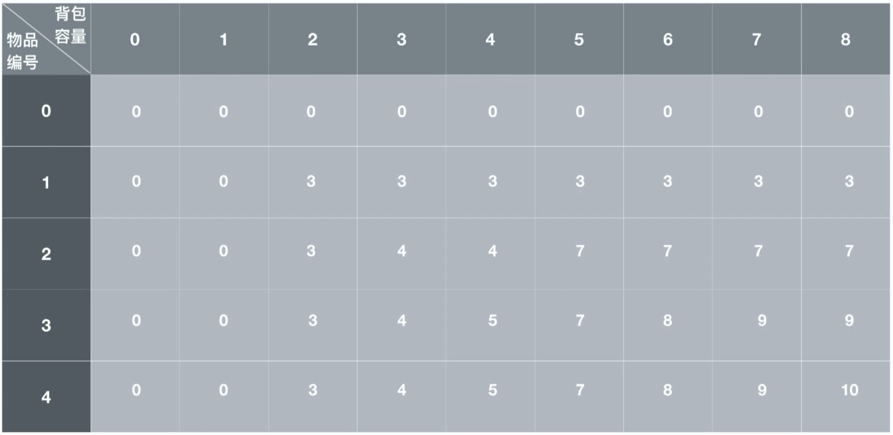

# 背包问题

## 0/1 背包问题

### 问题描述：有n件物品和容量为m的背包 给出i件物品的重量以及价值 求解让装入背包的物品重量不超过背包容量 且价值最大 。
### 特点:这是最简单的背包问题，特点是每个物品只有一件供你选择放还是不放。

### 思路：

使用动态规划解决：如果当前物品的容量小于物品的体积，那么就不装填。

1. 如果装不下当前物品，那么前 n 个物品的最佳组合和前 n - 1 个物品的最佳组合是一样的

2. 如果装得下当前物品

   a. 装当前物品，在给当前物品预留了相应空间的情况下， 前 n - 1个物品的最佳组合加上当前物品的价值就是总价值。

   b. 不装当前物品，那么前 n 个物品的最佳组合和前 n - 1个物品的最佳组合是一样的

   c. 选取 a 和 b 种较大的价值，为当前最佳组合的价值。

 

#### 背包问题的回溯

在使得背包内总价值最大的情况下， 背包内装了哪些物品。

倒推：从最后右下角开始，比较最右下方，如果没有装最后一个物品，那么 n - 1 的价值应该与 1 相同。不同说明装了，因此要在背包中预留出最后一个物品的位置。即去对应的体积中查找。依此类推。