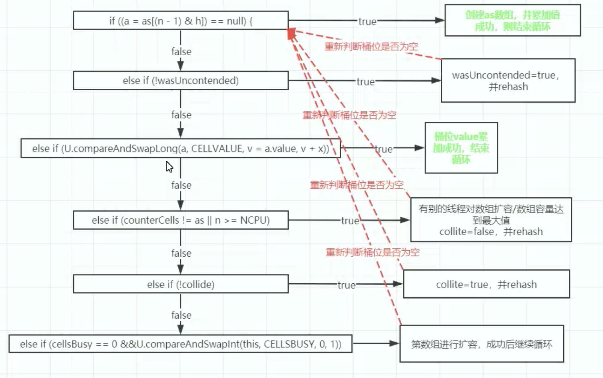

#   ConcurrentHashmap

## 初始化

```java
//jdk8.0 会初始化一个长度为64的map tableSizeFor(initialCapacity + (initialCapacity >>> 1) + 1)
final ConcurrentHashMap map = new ConcurrentHashMap(32);
```

## sizeCtl

**注意，构造方法中，都涉及到一个变量 `sizeCtl`， 这个变量是一个非常重要的变量**

sizeCtl=0 代表数组尚未初始化，且数组的初始容量为16

sizeCtl为正数，如果数组尚未初始化，那么其记录的是数组的初始容量，如果数组已经初始化，那么记录的是数组的扩容阈值

sizeCtl为-1，表示数组正在进行初始化

sizeCtl<0 && != -1表示数组正在扩容， -(1 + n) 表示此时有n个线程正在共同完成数组的扩容操作。

## putVal

```java
final V putVal(K key, V value, boolean onlyIfAbsent) {
        if (key == null || value == null) throw new NullPointerException();
  			// 一定是一个正数 因为计算后需要 & HASH_BITS 0x7FFFFFFF(0111111111111111)最高位永远是 0
        int hash = spread(key.hashCode());
        int binCount = 0;
        for (Node<K,V>[] tab = table;;) {
            Node<K,V> f; int n, i, fh;
            if (tab == null || (n = tab.length) == 0)
                tab = initTable();
            else if ((f = tabAt(tab, i = (n - 1) & hash)) == null) {
              //没有元素 cas + 自旋 
                if (casTabAt(tab, i, null,
                             new Node<K,V>(hash, key, value, null)))
                    break;                   // no lock when adding to empty bin
            }
            else if ((fh = f.hash) == MOVED)
              //帮助扩容
                tab = helpTransfer(tab, f);
            else {
                V oldVal = null;
                synchronized (f) {
                  //判断是否树化，移动了位置
                    if (tabAt(tab, i) == f) {
                      //链表结构
                        if (fh >= 0) {
                            binCount = 1;
                            for (Node<K,V> e = f;; ++binCount) {
                                K ek;
                                if (e.hash == hash &&
                                    ((ek = e.key) == key ||
                                     (ek != null && key.equals(ek)))) {
                                    oldVal = e.val;
                                    if (!onlyIfAbsent)
                                        e.val = value;
                                    break;
                                }
                                Node<K,V> pred = e;
                                if ((e = e.next) == null) {
                                    pred.next = new Node<K,V>(hash, key,
                                                              value, null);
                                    break;
                                }
                            }
                        } //树结构
                        else if (f instanceof TreeBin) {
                            Node<K,V> p;
                            binCount = 2;
                            if ((p = ((TreeBin<K,V>)f).putTreeVal(hash, key,
                                                           value)) != null) {
                                oldVal = p.val;
                                if (!onlyIfAbsent)
                                    p.val = value;
                            }
                        }
                    }
                }
                if (binCount != 0) {
                  //判断链表程度是否大于8，如果大于8小于64也会优先进行扩容，扩容为原来的2倍
                    if (binCount >= TREEIFY_THRESHOLD)
                        treeifyBin(tab, i);
                    if (oldVal != null)
                        return oldVal;
                    break;
                }
            }
        }
  			//增加之后要进行判断是否扩容
        addCount(1L, binCount);
        return null;
    }
```

## initTable

```java
private final Node<K,V>[] initTable() {
        Node<K,V>[] tab; int sc;
        while ((tab = table) == null || tab.length == 0) {
            if ((sc = sizeCtl) < 0)
                Thread.yield(); // lost initialization race; just spin
            else if (U.compareAndSwapInt(this, SIZECTL, sc, -1)) {
                try {
                    if ((tab = table) == null || tab.length == 0) {
                        int n = (sc > 0) ? sc : DEFAULT_CAPACITY;
                        @SuppressWarnings("unchecked")
                        Node<K,V>[] nt = (Node<K,V>[])new Node<?,?>[n];
                        table = tab = nt;
                        sc = n - (n >>> 2);
                    }
                } finally {
                    sizeCtl = sc;
                }
                break;
            }
        }
        return tab;
    }
```

## addCount

```java
private final void addCount(long x, int check) {
  			//维护集合长度
        CounterCell[] as; long b, s;
  			//先判断是否为空，再判断 baseCount与主存中的是否一致。然后进行 + 1
  			//两个线程同时进行时，先判断数组是否为空，为空，直接进行fullAddCount
        if ((as = counterCells) != null ||
            !U.compareAndSwapLong(this, BASECOUNT, b = baseCount, s = b + x)) {
            CounterCell a; long v; int m;
            boolean uncontended = true;
            if (as == null || (m = as.length - 1) < 0 ||
                (a = as[ThreadLocalRandom.getProbe() & m]) == null ||
                !(uncontended =
                  U.compareAndSwapLong(a, CELLVALUE, v = a.value, v + x))) {
                fullAddCount(x, uncontended);
                return;
            }
            if (check <= 1)
                return;
          //遍历 counterCell 的值，进行求和
            s = sumCount();
        }
  		//check 就是传进来的 binCount 代表遍历了几次，如果是添加元素一定是 >0 的
        if (check >= 0) {
            Node<K,V>[] tab, nt; int n, sc;
            while (s >= (long)(sc = sizeCtl) && (tab = table) != null &&
                   (n = tab.length) < MAXIMUM_CAPACITY) {
                int rs = resizeStamp(n);
                if (sc < 0) {
                    if ((sc >>> RESIZE_STAMP_SHIFT) != rs || sc == rs + 1 ||
                        sc == rs + MAX_RESIZERS || (nt = nextTable) == null ||
                        transferIndex <= 0)
                        break;
                  //协助扩容
                    if (U.compareAndSwapInt(this, SIZECTL, sc, sc + 1))
                        transfer(tab, nt);
                }
              //rs 变为负数，此时 sc 也变为了负数，说明正在进行扩容
                else if (U.compareAndSwapInt(this, SIZECTL, sc,
                                             (rs << RESIZE_STAMP_SHIFT) + 2))
                    transfer(tab, null);
                s = sumCount();
            }
        }
    }

```

## fullAddCount

内部维护了一个 baseCount 字段，每次进行增加元素时，都会维护这个字段。生成一个 counterCell 的数组，这个数组内部维护的就是每一个 value值，求和就是整个的 baseCount。

首先会计算 hash值，也就是这个桶位是否有couterCell对象，如果没有就生成，并对 value进行加值运算。如果有，就会判断是否之前进行加的尝试，如果返回false，那么就会重新计算hash；循环回来继续用 cas 进行自旋加。

```java
private final void fullAddCount(long x, boolean wasUncontended) {
        int h;
  			//计算数组桶位，counterCell的
        if ((h = ThreadLocalRandom.getProbe()) == 0) {
            ThreadLocalRandom.localInit();      // force initialization
            h = ThreadLocalRandom.getProbe();
            wasUncontended = true;
        }
        boolean collide = false;                // True if last slot nonempty
        for (;;) {
            CounterCell[] as; CounterCell a; int n; long v;
            if ((as = counterCells) != null && (n = as.length) > 0) {
                if ((a = as[(n - 1) & h]) == null) {
                  //没有就创建一个 counterCell 并存储到数组的对应位置
                    if (cellsBusy == 0) {            // Try to attach new Cell
                        CounterCell r = new CounterCell(x); // Optimistic create
                        if (cellsBusy == 0 &&
                            U.compareAndSwapInt(this, CELLSBUSY, 0, 1)) {
                            boolean created = false;
                            try {               // Recheck under lock
                                CounterCell[] rs; int m, j;
                                if ((rs = counterCells) != null &&
                                    (m = rs.length) > 0 &&
                                    rs[j = (m - 1) & h] == null) {
                                    rs[j] = r;
                                    created = true;
                                }
                            } finally {
                                cellsBusy = 0;
                            }
                            if (created)
                                break;
                            continue;           // Slot is now non-empty
                        }
                    }
                    collide = false;
                }
                else if (!wasUncontended)       // CAS already known to fail
                    wasUncontended = true;      // Continue after rehash
              //如果有直接进行加动作
                else if (U.compareAndSwapLong(a, CELLVALUE, v = a.value, v + x))
                    break;
              //数组长度如果大于 ncpu ，数组长度已经达到最大
                else if (counterCells != as || n >= NCPU)
                    collide = false;            // At max size or stale
                else if (!collide)
                    collide = true;
              //如果加失败，多次自旋后，就会进行数组的扩容
                else if (cellsBusy == 0 &&
                         U.compareAndSwapInt(this, CELLSBUSY, 0, 1)) {
                    try {
                        if (counterCells == as) {// Expand table unless stale
                            CounterCell[] rs = new CounterCell[n << 1];
                            for (int i = 0; i < n; ++i)
                                rs[i] = as[i];
                            counterCells = rs;
                        }
                    } finally {
                        cellsBusy = 0;
                    }
                    collide = false;
                    continue;                   // Retry with expanded table
                }
                h = ThreadLocalRandom.advanceProbe(h);
            }
            else if (cellsBusy == 0 && counterCells == as &&
                     U.compareAndSwapInt(this, CELLSBUSY, 0, 1)) {
                boolean init = false;
                try {                           // Initialize table
                    if (counterCells == as) {
                      //初始化后，数组长度扩成2
                        CounterCell[] rs = new CounterCell[2];
                        rs[h & 1] = new CounterCell(x);
                        counterCells = rs;
                        init = true;
                    }
                } finally {
                    cellsBusy = 0;
                }
                if (init)
                    break;
            }
            else if (U.compareAndSwapLong(this, BASECOUNT, v = baseCount, v + x))
                break;                          // Fall back on using base
        }
    }
```




## resizeStamp

将 1 向左移 15 位

```java
static final int resizeStamp(int n) {
        return Integer.numberOfLeadingZeros(n) | (1 << (RESIZE_STAMP_BITS - 1));
    }
```

## transfer

```java
private final void transfer(Node<K,V>[] tab, Node<K,V>[] nextTab) {
        int n = tab.length, stride;
  			// 多核 先除 8，并且是否小于16，小于16就是一个线程负责16个，否则使用计算出来的值
  			//从后向前迁移
        if ((stride = (NCPU > 1) ? (n >>> 3) / NCPU : n) < MIN_TRANSFER_STRIDE)
            stride = MIN_TRANSFER_STRIDE; // subdivide range
  		//第一次进行扩容，迁移完成后，会给原数组的位置赋值 fwd 节点，这个节点的 hash值是 -1
        if (nextTab == null) {            // initiating
            try {
                @SuppressWarnings("unchecked")
                Node<K,V>[] nt = (Node<K,V>[])new Node<?,?>[n << 1];
                nextTab = nt;
            } catch (Throwable ex) {      // try to cope with OOME
                sizeCtl = Integer.MAX_VALUE;
                return;
            }
          //记录新的数组 2 倍长度，以及旧数组的size
            nextTable = nextTab;
            transferIndex = n;
        }
        int nextn = nextTab.length;
        ForwardingNode<K,V> fwd = new ForwardingNode<K,V>(nextTab);
        boolean advance = true;
        boolean finishing = false; // to ensure sweep before committing nextTab
        for (int i = 0, bound = 0;;) {
            Node<K,V> f; int fh;
            while (advance) {
                int nextIndex, nextBound;
                if (--i >= bound || finishing)
                    advance = false;
                else if ((nextIndex = transferIndex) <= 0) {
                    i = -1;
                    advance = false;
                }
              //进行任务分配，是否大于 stride 如果大于，就减去，得到下一次开始的边界；如果不大于，就置为 0
              //做完了，就会再次重新分配任务
                else if (U.compareAndSwapInt
                         (this, TRANSFERINDEX, nextIndex,
                          nextBound = (nextIndex > stride ?
                                       nextIndex - stride : 0))) {
                    bound = nextBound;
                    i = nextIndex - 1;
                    advance = false;
                }
            }
            if (i < 0 || i >= n || i + n >= nextn) {
                int sc;
              //如果完成，会修改阈值
                if (finishing) {
                    nextTable = null;
                    table = nextTab;
                  //n * 2 - n / 2 = 0.75 * 2
                    sizeCtl = (n << 1) - (n >>> 1);
                    return;
                }
                if (U.compareAndSwapInt(this, SIZECTL, sc = sizeCtl, sc - 1)) {
                  //判断任务是否完成，与进入方法时呼应
                    if ((sc - 2) != resizeStamp(n) << RESIZE_STAMP_SHIFT)
                        return;
                  //结束循环
                    finishing = advance = true;
                    i = n; // recheck before commit
                }
            }
          //迁移过程。判断是否为空，空则不迁移，直接放入 fwd 节点。否则判断是否是正在迁移或者是迁移过的。
            else if ((f = tabAt(tab, i)) == null)
                advance = casTabAt(tab, i, null, fwd);
            else if ((fh = f.hash) == MOVED)
                advance = true; // already processed
            else {
              //进行迁移，防止迁移时，有另一个线程进行添加数据。正在做迁移时，不可能进行添加数据。至于添加和迁移就要看谁能抢到锁
                synchronized (f) {
                    if (tabAt(tab, i) == f) {
                        Node<K,V> ln, hn;
                        if (fh >= 0) {
                            int runBit = fh & n;
                            Node<K,V> lastRun = f;
                            for (Node<K,V> p = f.next; p != null; p = p.next) {
                                int b = p.hash & n;
                                if (b != runBit) {
                                    runBit = b;
                                    lastRun = p;
                                }
                            }
                            if (runBit == 0) {
                                ln = lastRun;
                                hn = null;
                            }
                            else {
                                hn = lastRun;
                                ln = null;
                            }
                            for (Node<K,V> p = f; p != lastRun; p = p.next) {
                                int ph = p.hash; K pk = p.key; V pv = p.val;
                                if ((ph & n) == 0)
                                    ln = new Node<K,V>(ph, pk, pv, ln);
                                else
                                    hn = new Node<K,V>(ph, pk, pv, hn);
                            }
                            setTabAt(nextTab, i, ln);
                            setTabAt(nextTab, i + n, hn);
                          //最后加入 fwd
                            setTabAt(tab, i, fwd);
                            advance = true;
                        }
                        else if (f instanceof TreeBin) {
                            TreeBin<K,V> t = (TreeBin<K,V>)f;
                            TreeNode<K,V> lo = null, loTail = null;
                            TreeNode<K,V> hi = null, hiTail = null;
                            int lc = 0, hc = 0;
                            for (Node<K,V> e = t.first; e != null; e = e.next) {
                                int h = e.hash;
                                TreeNode<K,V> p = new TreeNode<K,V>
                                    (h, e.key, e.val, null, null);
                                if ((h & n) == 0) {
                                    if ((p.prev = loTail) == null)
                                        lo = p;
                                    else
                                        loTail.next = p;
                                    loTail = p;
                                    ++lc;
                                }
                                else {
                                    if ((p.prev = hiTail) == null)
                                        hi = p;
                                    else
                                        hiTail.next = p;
                                    hiTail = p;
                                    ++hc;
                                }
                            }
                            ln = (lc <= UNTREEIFY_THRESHOLD) ? untreeify(lo) :
                                (hc != 0) ? new TreeBin<K,V>(lo) : t;
                            hn = (hc <= UNTREEIFY_THRESHOLD) ? untreeify(hi) :
                                (lc != 0) ? new TreeBin<K,V>(hi) : t;
                            setTabAt(nextTab, i, ln);
                            setTabAt(nextTab, i + n, hn);
                            setTabAt(tab, i, fwd);
                            advance = true;
                        }
                    }
                }
            }
        }
    }
```


## helpTransfer

```java
/**
     * Helps transfer if a resize is in progress.
     */
    final Node<K,V>[] helpTransfer(Node<K,V>[] tab, Node<K,V> f) {
        Node<K,V>[] nextTab; int sc;
        if (tab != null && (f instanceof ForwardingNode) &&
            (nextTab = ((ForwardingNode<K,V>)f).nextTable) != null) {
            int rs = resizeStamp(tab.length);
            while (nextTab == nextTable && table == tab &&
                   (sc = sizeCtl) < 0) {
                if ((sc >>> RESIZE_STAMP_SHIFT) != rs || sc == rs + 1 ||
                    sc == rs + MAX_RESIZERS || transferIndex <= 0)
                    break;
                if (U.compareAndSwapInt(this, SIZECTL, sc, sc + 1)) {
                    transfer(tab, nextTab);
                    break;
                }
            }
            return nextTab;
        }
        return table;
    }
```

