# HashSet
## 底层实现
```java
/**
 * Constructs a new, empty set; the backing <tt>HashMap</tt> instance has
* default initial capacity (16) and load factor (0.75).
 */
public HashSet() {
    map = new HashMap<>();
}
```
* HashSet 底层是用 HashMap 实现的

```java
// Dummy value to associate with an Object in the backing Map
    private static final Object PRESENT = new Object();
/**
     * Adds the specified element to this set if it is not already present.
     * More formally, adds the specified element <tt>e</tt> to this set if
     * this set contains no element <tt>e2</tt> such that
     * <tt>(e==null&nbsp;?&nbsp;e2==null&nbsp;:&nbsp;e.equals(e2))</tt>.
     * If this set already contains the element, the call leaves the set
     * unchanged and returns <tt>false</tt>.
     *
     * @param e element to be added to this set
     * @return <tt>true</tt> if this set did not already contain the specified
     * element
     */
    public boolean add(E e) {
        return map.put(e, PRESENT)==null;
    }
```
* `add`返回一个`boolean`,实际上添加的对象被当作`key`来维护，`value`则是一个常量

```java
    /**
     * Removes the specified element from this set if it is present.
     * More formally, removes an element <tt>e</tt> such that
     * <tt>(o==null&nbsp;?&nbsp;e==null&nbsp;:&nbsp;o.equals(e))</tt>,
     * if this set contains such an element.  Returns <tt>true</tt> if
     * this set contained the element (or equivalently, if this set
     * changed as a result of the call).  (This set will not contain the
     * element once the call returns.)
     *
     * @param o object to be removed from this set, if present
     * @return <tt>true</tt> if the set contained the specified element
     */
    public boolean remove(Object o) {
        return map.remove(o)==PRESENT;
    }
```
* `remove, iterator, contains, `底层也是使用的`map`的方法 

# HashMap
## 底层实现
### 常量属性
```java
/**
     * The default initial capacity - MUST be a power of two.
     * 缺省大小
     */
    static final int DEFAULT_INITIAL_CAPACITY = 1 << 4; // aka 16
/**
     * The maximum capacity, used if a higher value is implicitly specified
     * by either of the constructors with arguments.
     * MUST be a power of two <= 1<<30.
     * 缺省最大 2^30
     */
    static final int MAXIMUM_CAPACITY = 1 << 30;
/**
     * The load factor used when none specified in constructor.
     */
    static final float DEFAULT_LOAD_FACTOR = 0.75f;
/**
     * The bin count threshold for using a tree rather than list for a
     * bin.  Bins are converted to trees when adding an element to a
     * bin with at least this many nodes. The value must be greater
     * than 2 and should be at least 8 to mesh with assumptions in
     * tree removal about conversion back to plain bins upon
     * shrinkage.
     * 树化阈值
     */
    static final int TREEIFY_THRESHOLD = 8;

/**
     * The bin count threshold for untreeifying a (split) bin during a
     * resize operation. Should be less than TREEIFY_THRESHOLD, and at
     * most 6 to mesh with shrinkage detection under removal.
     * 树降级成为链表
     */
    static final int UNTREEIFY_THRESHOLD = 6;
/**
     * The smallest table capacity for which bins may be treeified.
     * (Otherwise the table is resized if too many nodes in a bin.)
     * Should be at least 4 * TREEIFY_THRESHOLD to avoid conflicts
     * between resizing and treeification thresholds.
     * 当表中的所有元素个数超过 64 时，才会允许树化
     */
    static final int MIN_TREEIFY_CAPACITY = 64; 
```
### 基本变量
```java
/**
     * The table, initialized on first use, and resized as
     * necessary. When allocated, length is always a power of two.
     * (We also tolerate length zero in some operations to allow
     * bootstrapping mechanics that are currently not needed.)
     * 哈希表
     */
    transient Node<K,V>[] table;

    /**
     * Holds cached entrySet(). Note that AbstractMap fields are used
     * for keySet() and values().
     */
    transient Set<Map.Entry<K,V>> entrySet;

    /**
     * The number of key-value mappings contained in this map.
     * 哈希表的大小
     */
    transient int size;

    /**
     * The number of times this HashMap has been structurally modified
     * Structural modifications are those that change the number of mappings in
     * the HashMap or otherwise modify its internal structure (e.g.,
     * rehash).  This field is used to make iterators on Collection-views of
     * the HashMap fail-fast.  (See ConcurrentModificationException
     * 修改次数
     * 替换当前<K, V>不算，插入或减少元素才算
     */
    transient int modCount;
    /**
     * The next size value at which to resize (capacity * load factor).
     *
     * 扩容阈值，哈希表中的元素超过阈值时触发扩容
     * @serial
     */
    // (The javadoc description is true upon serialization.
    // Additionally, if the table array has not been allocated, this
    // field holds the initial array capacity, or zero signifying
    // DEFAULT_INITIAL_CAPACITY.)
    int threshold;

    /**
     * The load factor for the hash table.
     * 默认负载因子
     * @serial
     */
    final float loadFactor;
```
### 构造方法
```java
    /**
     * Constructs an empty <tt>HashMap</tt> with the specified initial
     * capacity and load factor.
     *
     * @param  initialCapacity the initial capacity
     * @param  loadFactor      the load factor
     * @throws IllegalArgumentException if the initial capacity is negative
     *         or the load factor is nonpositive
     */
    public HashMap(int initialCapacity, float loadFactor) {
        // < 0 不合法
        if (initialCapacity < 0)
            throw new IllegalArgumentException("Illegal initial capacity: " +
                                               initialCapacity);
        // 最大创建的大小也就是 MAXIMUM_CAP
        if (initialCapacity > MAXIMUM_CAPACITY)
            initialCapacity = MAXIMUM_CAPACITY;
        //负载因子的校验
        if (loadFactor <= 0 || Float.isNaN(loadFactor))
            throw new IllegalArgumentException("Illegal load factor: " +
                                               loadFactor);
        this.loadFactor = loadFactor;
        //计算阈值
        this.threshold = tableSizeFor(initialCapacity);
    }

    /**
     * Constructs an empty <tt>HashMap</tt> with the specified initial
     * capacity and the default load factor (0.75).
     *
     * @param  initialCapacity the initial capacity.
     * @throws IllegalArgumentException if the initial capacity is negative.
     */
    public HashMap(int initialCapacity) {
        this(initialCapacity, DEFAULT_LOAD_FACTOR);
    }

    /**
     * Constructs an empty <tt>HashMap</tt> with the default initial capacity
     * (16) and the default load factor (0.75).
     */
    public HashMap() {
        this.loadFactor = DEFAULT_LOAD_FACTOR; // all other fields defaulted
    }

    /**
     * Constructs a new <tt>HashMap</tt> with the same mappings as the
     * specified <tt>Map</tt>.  The <tt>HashMap</tt> is created with
     * default load factor (0.75) and an initial capacity sufficient to
     * hold the mappings in the specified <tt>Map</tt>.
     *
     * @param   m the map whose mappings are to be placed in this map
     * @throws  NullPointerException if the specified map is null
     */
    public HashMap(Map<? extends K, ? extends V> m) {
        this.loadFactor = DEFAULT_LOAD_FACTOR;
        putMapEntries(m, false);
    }
```
### 阈值计算及图解
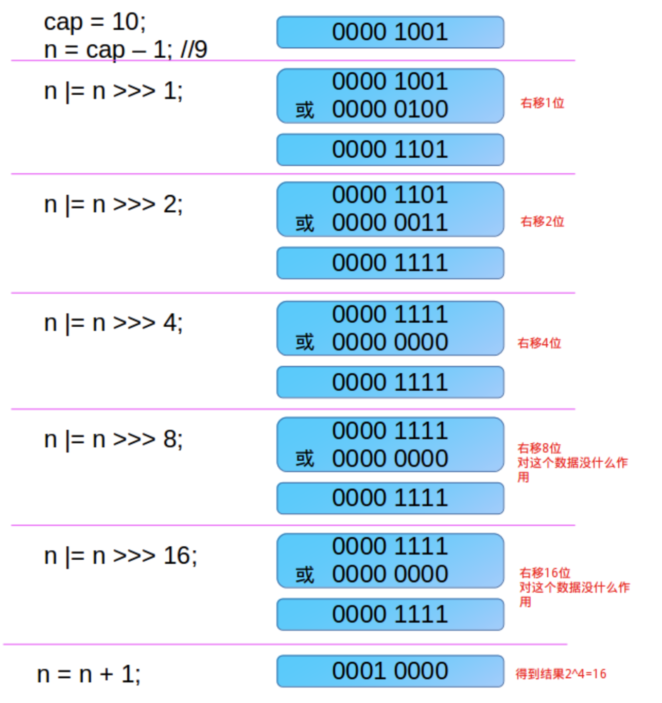
```java
/**
     * Returns a power of two size for the given target capacity.
     * 返回一个大于等于当前 cap 的一个数字，并且一定是 2 的 次方
     * cap = 10
     * n = cap - 1 = 9，防止初始容量已经是2的次幂形式，如果cap已经是2的幂， 又没有执行这个减1操作，则执行完后面的几条无符号右移操作之后，返回的capacity将是这个cap的2倍
     * 0b1001 | 0b0100 = 0b1101
     * 0b1101 | 0b0011 = 0b1111
     * 0b1111 | 0b0000 = 0b1111
     * 0b1111 = 15
     * 返回 15 + 1 = 16
     *
     * 如果 n = 10，经过以上运算会返回32
     */
    static final int tableSizeFor(int cap) {
        int n = cap - 1;
        n |= n >>> 1;
        n |= n >>> 2;
        n |= n >>> 4;
        n |= n >>> 8;
        n |= n >>> 16;
        return (n < 0) ? 1 : (n >= MAXIMUM_CAPACITY) ? MAXIMUM_CAPACITY : n + 1;
    }
```
### 内部维护了一个实现了`Map.Entry`的`Node`
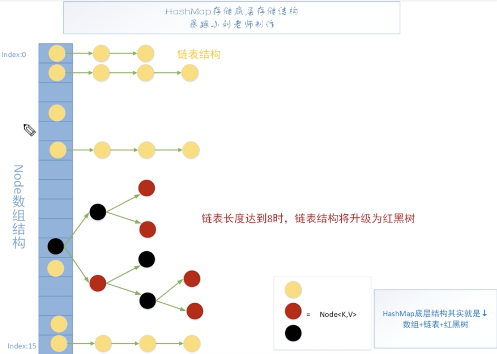

* 当链表长度达到8或者Node中的节点数达到64个，将会变为红黑树
* 数组长度为 Math.pow(2, n);
```java
/**
     * Basic hash bin node, used for most entries.  (See below for
     * TreeNode subclass, and in LinkedHashMap for its Entry subclass.)
     */
    static class Node<K,V> implements Map.Entry<K,V> {
        final int hash;
        final K key;
        V value;
        Node<K,V> next;

        Node(int hash, K key, V value, Node<K,V> next) {
            this.hash = hash;
            this.key = key;
            this.value = value;
            this.next = next;
        }

        public final K getKey()        { return key; }
        public final V getValue()      { return value; }
        public final String toString() { return key + "=" + value; }

        public final int hashCode() {
            return Objects.hashCode(key) ^ Objects.hashCode(value);
        }

        public final V setValue(V newValue) {
            V oldValue = value;
            value = newValue;
            return oldValue;
        }
```

### Put 过程
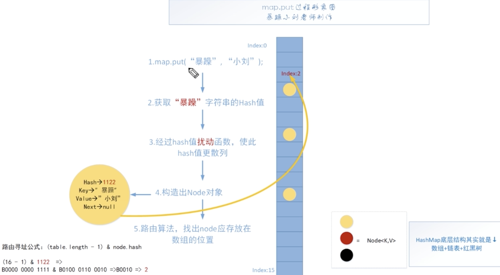
* 基于 `putVal` 实现
```java
/**
     * Associates the specified value with the specified key in this map.
     * If the map previously contained a mapping for the key, the old
     * value is replaced.
     *
     * @param key key with which the specified value is to be associated
     * @param value value to be associated with the specified key
     * @return the previous value associated with <tt>key</tt>, or
     *         <tt>null</tt> if there was no mapping for <tt>key</tt>.
     *         (A <tt>null</tt> return can also indicate that the map
     *         previously associated <tt>null</tt> with <tt>key</tt>.)
     */
    public V put(K key, V value) {
        return putVal(hash(key), key, value, false, true);
    }
```
* `hash`方法，扰动函数
    * 让 key 的hash值的高 16 位也参与路由运算
```java
/**
     * Computes key.hashCode() and spreads (XORs) higher bits of hash
     * to lower.  Because the table uses power-of-two masking, sets of
     * hashes that vary only in bits above the current mask will
     * always collide. (Among known examples are sets of Float keys
     * holding consecutive whole numbers in small tables.)  So we
     * apply a transform that spreads the impact of higher bits
     * downward. There is a tradeoff between speed, utility, and
     * quality of bit-spreading. Because many common sets of hashes
     * are already reasonably distributed (so don't benefit from
     * spreading), and because we use trees to handle large sets of
     * collisions in bins, we just XOR some shifted bits in the
     * cheapest possible way to reduce systematic lossage, as well as
     * to incorporate impact of the highest bits that would otherwise
     * never be used in index calculations because of table bounds.
     * table 大小较小的情况下，加入高位特征，减少冲突
     */
    static final int hash(Object key) {
        int h;
        // null也可以放进去，hash值 = 0
        //0010 0101 1010 1100 0011 1111 0010 1110
        //^
        //0000 0000 0000 0000 0010 0101 1010 1100
        //0010 0101 1010 1100 0001 1010 1000 0010
        return (key == null) ? 0 : (h = key.hashCode()) ^ (h >>> 16);
    }
```
```java
/**
     * Implements Map.put and related methods.
     *
     * @param hash hash for key
     * @param key the key
     * @param value the value to put
     * @param onlyIfAbsent if true, don't change existing value
     * @param evict if false, the table is in creation mode.
     * @return previous value, or null if none
     */
    final V putVal(int hash, K key, V value, boolean onlyIfAbsent,
                   boolean evict) {
        //tab引用当前hashMap散列表；p当前散列表的元素；n表示散列表数组的长度；i表示路由寻址的结果下标
        Node<K,V>[] tab; Node<K,V> p; int n, i;
        //懒初始化操作，第一次插入数据时才进行初始化散列表操作
        if ((tab = table) == null || (n = tab.length) == 0)
            n = (tab = resize()).length;
        
        //最简单的情况，计算数组中的位置当好为空，直接将值封装到Node中放入数组即可
        if ((p = tab[i = (n - 1) & hash]) == null)
            tab[i] = newNode(hash, key, value, null);
        else {
            //e不为null，说明找到了与要插入元素K V一样的元素
            //k为临时key
            Node<K,V> e; K k;
            //桶位中的元素与要插入的元素的K完全一致，后续需要进行替换操作。
            if (p.hash == hash &&
                ((k = p.key) == key || (key != null && key.equals(k))))
                e = p;
            //已经树化了的情况
            else if (p instanceof TreeNode)
                e = ((TreeNode<K,V>)p).putTreeVal(this, tab, hash, key, value);
            else {
                //是链表的情况，且表头和我们要插入的元素不同
                for (int binCount = 0; ; ++binCount) {
                    //最后一个元素也没有找到与当前元素一样的Node，表示可以插入
                    if ((e = p.next) == null) {
                        p.next = newNode(hash, key, value, null);
                        //插入后进行检查是否满足树化
                        if (binCount >= TREEIFY_THRESHOLD - 1) // -1 for 1st
                            treeifyBin(tab, hash);
                        break;
                    }
                    //找到了一样的元素，说明需要进行替换操作
                    if (e.hash == hash &&
                        ((k = e.key) == key || (key != null && key.equals(k))))
                        break;
                    p = e;
                }
            }
            //找到了相同的元素，需要进行替换操作
            if (e != null) { // existing mapping for key
                V oldValue = e.value;
                //如果可以进行替换，那么进行替换
                if (!onlyIfAbsent || oldValue == null)
                    e.value = value;
                afterNodeAccess(e);
                return oldValue;
            }
        }
        //增加已经修改的次数
        ++modCount;
        //检查当前数组的节点数量
        if (++size > threshold)
            resize();
        afterNodeInsertion(evict);
        return null;
    }
```
### 扩容方法
```java
/**
     * Initializes or doubles table size.  If null, allocates in
     * accord with initial capacity target held in field threshold.
     * Otherwise, because we are using power-of-two expansion, the
     * elements from each bin must either stay at same index, or move
     * with a power of two offset in the new table.
     *
     * 解决哈希冲突导致的链化影响查询效率，使用扩容解决
     * @return the table
     */
    final Node<K,V>[] resize() {
        //扩容前的哈希表
        Node<K,V>[] oldTab = table;
        //扩容前数组的长度
        int oldCap = (oldTab == null) ? 0 : oldTab.length;
        //触发本次扩容的阈值
        int oldThr = threshold;
        //扩容后的新数组大小，以及阈值
        int newCap, newThr = 0;
        //当前的表已经经过了初始化，是一次正常的扩容操作
        if (oldCap > 0) {
            //扩容之前的数组大小已经达到了最大值，不扩容且设置下次扩容阈值位Integer.MAXVALUE，并返回当前的数组
            if (oldCap >= MAXIMUM_CAPACITY) {
                threshold = Integer.MAX_VALUE;
                return oldTab;
            }
            //oldCap左移一位，并且小于最大容量，并且oldCap要大于等于初始化的16，则下一次扩容的阈值等于当前阈值的二倍。
            //传一个小于 16 的数就不会进入
            else if ((newCap = oldCap << 1) < MAXIMUM_CAPACITY &&
                     oldCap >= DEFAULT_INITIAL_CAPACITY)
                newThr = oldThr << 1; // double threshold
        }
        //oldCap == 0 说明 null 需要进行初始化
        //1. new HashMap(initCap, loadFactor)
        //2. new HashMap(initCap)
        //3. new HashMap(map)且 map中有数据
        else if (oldThr > 0) // initial capacity was placed in threshold
            newCap = oldThr;
        //new HashMap();
        else {               // zero initial threshold signifies using defaults
            newCap = DEFAULT_INITIAL_CAPACITY;
            newThr = (int)(DEFAULT_LOAD_FACTOR * DEFAULT_INITIAL_CAPACITY);
        }
        //newThr为0时通过newCap和loadFactor进行计算出一个值 
        if (newThr == 0) {
            float ft = (float)newCap * loadFactor;
            newThr = (newCap < MAXIMUM_CAPACITY && ft < (float)MAXIMUM_CAPACITY ?
                      (int)ft : Integer.MAX_VALUE);
        }
        threshold = newThr;
        @SuppressWarnings({"rawtypes","unchecked"})
        Node<K,V>[] newTab = (Node<K,V>[])new Node[newCap];
        table = newTab;
        //扩容之前，table不为空
        if (oldTab != null) {
            //当前节点
            for (int j = 0; j < oldCap; ++j) {
                Node<K,V> e;
                //当前位置有数据，但是数据的类型并不清楚
                if ((e = oldTab[j]) != null) {
                    //先赋值，再清除，便于jvm回收
                    oldTab[j] = null;
                    //下一个为空，说明只有这一个元素，未发生过碰撞，重新计算位置
                    if (e.next == null)
                        newTab[e.hash & (newCap - 1)] = e;
                    //是否树化
                    else if (e instanceof TreeNode)
                        ((TreeNode<K,V>)e).split(this, newTab, j, oldCap);
                    //处理链表情况
                    else { // preserve order
                        //拆分了两个链表：
                        //低位链表：存放在扩容之后数组的下标位置与扩容之前的位置一致
                        //高位链表：存放在扩容之后数组的下表位置为：当前数组的下表+扩容之前的数组长度，原来15 现在15 + 16 = 31
                        Node<K,V> loHead = null, loTail = null;
                        Node<K,V> hiHead = null, hiTail = null;
                        Node<K,V> next;
                        
                        do {
                            next = e.next;
                            //..0 1111
                            //&
                            //..1 0000
                            //只能是0 或者 全是1；为0只能放置在低，表示原来的位置，否则表示放在高位
                            if ((e.hash & oldCap) == 0) {
                                if (loTail == null)
                                    loHead = e;
                                else
                                    loTail.next = e;
                                loTail = e;
                            }
                            else {
                                if (hiTail == null)
                                    hiHead = e;
                                else
                                    hiTail.next = e;
                                hiTail = e;
                            }
                        } while ((e = next) != null);
                        if (loTail != null) {
                            loTail.next = null;
                            newTab[j] = loHead;
                        }
                        if (hiTail != null) {
                            hiTail.next = null;
                            newTab[j + oldCap] = hiHead;
                        }
                    }
                }
            }
        }
        return newTab;
    }
```
### 获取值
```java
/**
     * Returns the value to which the specified key is mapped,
     * or {@code null} if this map contains no mapping for the key.
     *
     * <p>More formally, if this map contains a mapping from a key
     * {@code k} to a value {@code v} such that {@code (key==null ? k==null :
     * key.equals(k))}, then this method returns {@code v}; otherwise
     * it returns {@code null}.  (There can be at most one such mapping.)
     *
     * <p>A return value of {@code null} does not <i>necessarily</i>
     * indicate that the map contains no mapping for the key; it's also
     * possible that the map explicitly maps the key to {@code null}.
     * The {@link #containsKey containsKey} operation may be used to
     * distinguish these two cases.
     *
     * @see #put(Object, Object)
     */
    public V get(Object key) {
        Node<K,V> e;
        return (e = getNode(hash(key), key)) == null ? null : e.value;
    }

    /**
     * Implements Map.get and related methods.
     *
     * @param hash hash for key
     * @param key the key
     * @return the node, or null if none
     */
    final Node<K,V> getNode(int hash, Object key) {
        //tab：当前数组；first桶位中对应位置的头元素；e临时Node；n数组的长度
        Node<K,V>[] tab; Node<K,V> first, e; int n; K k;
        if ((tab = table) != null && (n = tab.length) > 0 &&
            (first = tab[(n - 1) & hash]) != null) {
            //头元素与要查找的元素相同，直接返回
            if (first.hash == hash && // always check first node
                ((k = first.key) == key || (key != null && key.equals(k))))
                return first;
            //不是单个元素，如果单个元素不相等直接返回null；因此要向后查找
            if ((e = first.next) != null) {
                //树
                if (first instanceof TreeNode)
                    return ((TreeNode<K,V>)first).getTreeNode(hash, key);
                //链表
                do {
                    if (e.hash == hash &&
                        ((k = e.key) == key || (key != null && key.equals(k))))
                        return e;
                } while ((e = e.next) != null);
            }
        }
        return null;
    }
```
### 删除方法
```java
/**
     * Removes the mapping for the specified key from this map if present.
     *
     * @param  key key whose mapping is to be removed from the map
     * @return the previous value associated with <tt>key</tt>, or
     *         <tt>null</tt> if there was no mapping for <tt>key</tt>.
     *         (A <tt>null</tt> return can also indicate that the map
     *         previously associated <tt>null</tt> with <tt>key</tt>.)
     */
    public V remove(Object key) {
        Node<K,V> e;
        return (e = removeNode(hash(key), key, null, false, true)) == null ?
            null : e.value;
    }

    /**
     * Implements Map.remove and related methods.
     *
     * @param hash hash for key
     * @param key the key
     * @param value the value to match if matchValue, else ignored
     * @param matchValue if true only remove if value is equal,值相等才删除
     * @param movable if false do not move other nodes while removing
     * @return the node, or null if none
     */
    final Node<K,V> removeNode(int hash, Object key, Object value,
                               boolean matchValue, boolean movable) {
        //tab当前散列表；p当前元素；n散列表长度；index删除的位置
        Node<K,V>[] tab; Node<K,V> p; int n, index;
        //要删除的位置是有数据的，需要进行匹配操作，并且删除
        if ((tab = table) != null && (n = tab.length) > 0 &&
            (p = tab[index = (n - 1) & hash]) != null) {
            //node查找到的结果，e当前元素的下一个元素
            Node<K,V> node = null, e; K k; V v;
            //找到元素
            if (p.hash == hash &&
                ((k = p.key) == key || (key != null && key.equals(k))))
                node = p;
            //否则为链表或者为树
            else if ((e = p.next) != null) {
                //树
                if (p instanceof TreeNode)
                    node = ((TreeNode<K,V>)p).getTreeNode(hash, key);
                else {
                    //链表查找
                    do {
                        if (e.hash == hash &&
                            ((k = e.key) == key ||
                             (key != null && key.equals(k)))) {
                            node = e;
                            break;
                        }
                        p = e;
                    } while ((e = e.next) != null);
                }
            }
            //查找操作完毕，需要进行删除元素的操作
            if (node != null && (!matchValue || (v = node.value) == value ||
                                 (value != null && value.equals(v)))) {
                //树的删除逻辑
                if (node instanceof TreeNode)
                    ((TreeNode<K,V>)node).removeTreeNode(this, tab, movable);
                //桶位元素与即为查找结果，将下一个节点向前移动，可以为null
                else if (node == p)
                    tab[index] = node.next;
                //继续移动
                else
                    p.next = node.next;
                ++modCount;
                --size;
                afterNodeRemoval(node);
                return node;
            }
        }
        return null;
    }
```
### 替换方法
```java
@Override
    public V replace(K key, V value) {
        Node<K,V> e;
        if ((e = getNode(hash(key), key)) != null) {
            V oldValue = e.value;
            e.value = value;
            afterNodeAccess(e);
            return oldValue;
        }
        return null;
    }
    @Override
    public boolean replace(K key, V oldValue, V newValue) {
        Node<K,V> e; V v;
        if ((e = getNode(hash(key), key)) != null &&
            ((v = e.value) == oldValue || (v != null && v.equals(oldValue)))) {
            e.value = newValue;
            afterNodeAccess(e);
            return true;
        }
        return false;
    }
}
```
### 小点
* hash & (table.length - 1)，当length是 2 的2次幂时成立，  这样得到的位置永远是0-table.length - 1;而且使用这个数值进行扩容，高低位链表处理：hash & size
* 设置为 8 进行树化也是为了降低查找次数，泊松分布，链表符合这个分布，加载0.75情况下， 长度为8的概率最低
* 数组长度没有达到64时，即使链表长度超过8，也不会转成红黑树，在`treeifyBin`中会有先进性扩容

## 红黑树
### 二叉搜索树在极端条件下可能会退化成为链表
* 推出平衡二叉树
* 平衡二叉树虽然解决了二叉搜索树极端条件下退化的问题，但是**平衡二叉树的要求太过严格**，导致每次进行插入操作都会调整树的左右子树，在插入删除操作频繁的场景中，平衡二叉树需要频繁的调整。
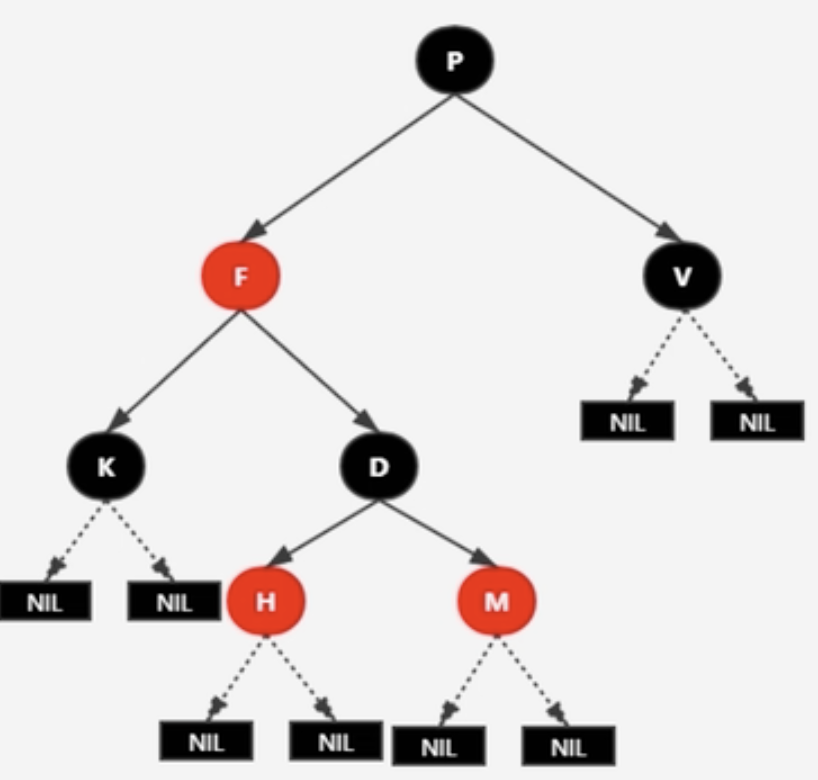
### 红黑树的性质
1. 每个节点，要么是黑色，要么是红色
2. 根节点为黑色
3. 叶子节点为黑色
4. 每个红色节点的两个子节点一定都是黑色的，不能有两个红色的节点相连
5. 任意一节点到每个叶子节点的路径都包含**相同数量的黑节点**，俗称黑高。
5.1 根据性质5可以推出，如果一个节点存在黑子节点，那么这个节点肯定存在两个子节点。
* 红黑树并不是一个完美平衡二叉查找树，从图中可以看到，根节点P的左子树明显比右子树高，但左右子树的黑色节点的层数是相等的，都为3层，也就是满足了性质5，所以我们成这种红黑树为**黑色完美平衡**

## 红黑树的操作
* 变色：节点颜色由红转黑或者由黑转红
* 左旋：以某个节点作为支点（旋转节点），其右子节点变为旋转节点的父节点，右子节点的左子节点变为旋转点的右子节点，左子节点保持不变。
* 右旋：以某个节点作为支点（旋转节点），其左子节点变为旋转节点的父节点，左子节点的右子节点变为旋转点的左子节点，右子节点保持不变。
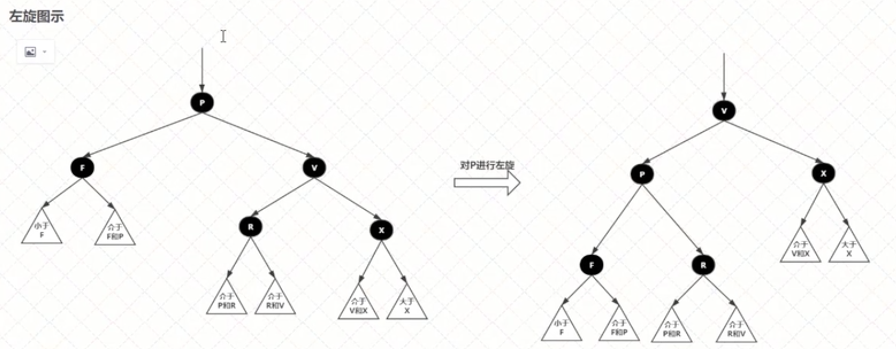
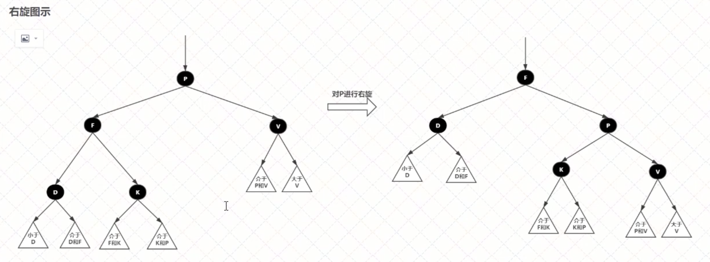
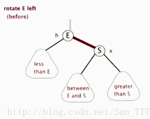
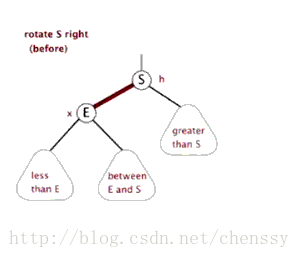

### 红黑树的查找与插入
* 插入：
    1. 找到要插入位置
    2. 调整位置使树平衡
    3. 注意，插入的节点必须为红色，红色在父节点为黑色节点时，红黑树的黑色平衡没有被破坏，不需要做自平衡操作；但如果插入节点是黑色，那么插入位置所在的子树黑色总是多1个，总需要做自平衡。

* 插入场景
    1. 空树：直接插入节点，并且设置为黑色
    2. 插入节点的key已存在：找到对应的值，并且更新值
    3. 插入节点的父节点为黑节点，无需进行调整，直接插入，不影响黑色完美平衡
    4. 插入节点的父节点为红节点，根据性质4，破坏了红黑树的性质
        * 若父节点的兄弟节点存在并为红色节点，此时根据性质4，爷爷节点必为**黑色**
            * 修改父亲与其兄弟节点为黑色，并将爷爷节点置为红色，然后将当前节点变为爷爷节点，继续操作。
            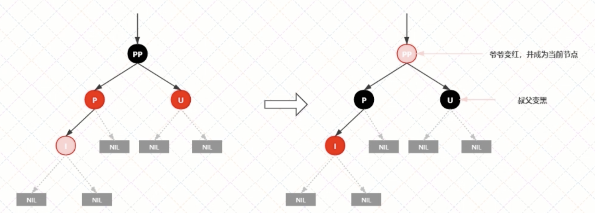
        * 若父亲的兄弟节点不存在或为黑色节点，并且插入节点的父亲节点是爷爷节点的**左子节点**
        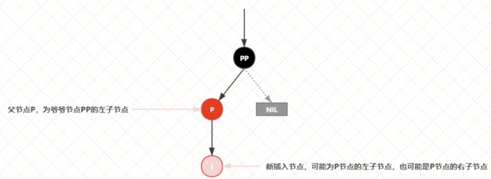
            * 若在左侧插入
                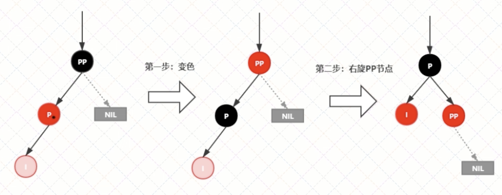
                * 先将父亲节点变为黑色，然后将爷爷节点变为红色
                * 对祖父节点进行右旋
            * 若在右侧插入 
                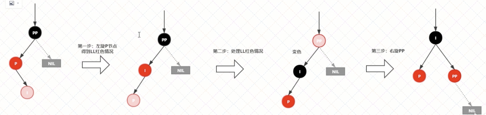
                * 将当前节点左旋，得到上一个情景
                * 然后将P节点的父节点置黑，再右旋
        * 若父亲的兄弟节点不存在或为黑色节点，并且插入节点的父亲节点是爷爷节点的**右子节点**
        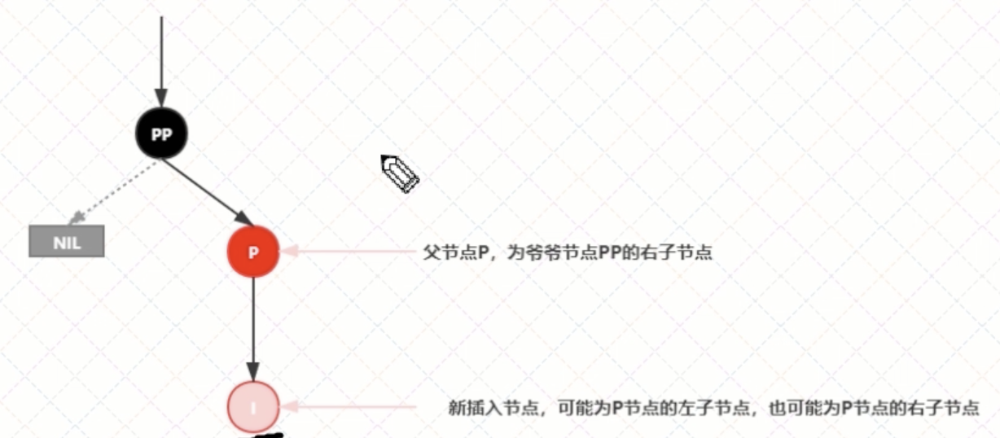
            * 新插入节点为其父节点的右子节点
                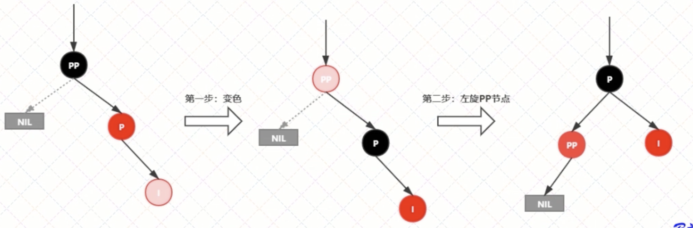
                * 将父节点变为黑色，祖父节点变为红色，祖父节点进行一次左旋
            
            * 新插入节点为父节点的左子节点
                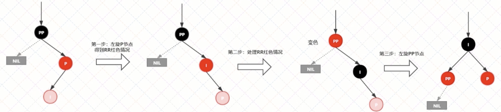
                * 先对当前节点的父亲节点进行一次右旋，然后变为和上一个一样的形式，对父亲节点和祖父节点进行变色，然后左旋祖父节点

### 实现
```java
/**
         * 中序遍历
         * @return
         */
        public void inorderPrint() {
            this.inorderPrint(root);
        }
        private void inorderPrint(RBNode node) {
            if (node == null) return;

            this.inorderPrint(node.left);
            System.out.println("key: " + node.key + " value: " + node.value);
            this.inorderPrint(node.left);
        }

        /**
         * 左旋
         *
         * 1. 将 x 右子节点 更新为 y 的左子节点，并更新左子节点的父节点
         * 2. 当 x 父节点不为空时，将其父节点的儿子节点更新为根节点的右儿子节点，并且将y的父亲节点更新
         * 3. 将 x 的父节点更新为 y， y 的 左子节点更新为 x
         *
         */
        private void leftRotate(RBNode x) {
            RBNode y = x.right;

            //将 x 的右子节点指向 y 的左子节点
            x.right = y.left;
            if (y.left != null) y.left.parent = x;

            if (x.parent != null) {
                y.parent = x.parent;

                if (x == x.parent.left) x.parent.left = y;
                else x.parent.right = y;
            } else {
                //说明是根节点
                this.root = y;
            }

            x.parent = y;
            y.left = x;
        }

        /**
         * 右旋
         * 1. 将 x 的左子节点更新为 y 的右子节点。并更新右子节点的父节点
         * 2. 当 x 的父节点不为空时，更新 父节点的儿子节点以及 y 的父亲节点
         * 3. 将 x 的父亲节点更新为 y y 的 右子节点更新为 x
         * @return
         */
        private void rightRotate(RBNode x) {
            RBNode y = x.left;

            x.left = y.right;
            if (y.right != null) y.right.parent = x;
            if (x.parent != null) {
                y.parent = x.parent;
                if (x == x.parent.left) x.parent.left = y;
                else x.parent.right = y;
            } else {
                this.root = y;
            }

            x.parent = y;
            y.right = x;
        }

        /**
         * 插入方法
         * @return
         */
        public void insert(K key, V value) {
            RBNode node = new RBNode();
            node.setKey(key);
            node.setValue(value);

            //新节点一定是红色
            node.setColor(RED);

        }
        private void insert(RBNode node) {
            //查找当前节点的父节点
            RBNode parent = null;
            RBNode x = this.root;

            while (node != null) {
                parent = x;

                //> 0 说明要在右子树查找 == 说明需要进行替换 < 0 说明要在左子树查找
                int cmp = node.key.compareTo(x.key);
                if (cmp > 0) {
                    x = x.right;
                } else if (cmp < 0) x = x.left;
                else {
                    x.setValue(node.getValue());
                    return;
                }
            }

            //更新父节点
            node.parent = parent;
            if (parent != null) {
                //判断node 与 parent大小关系
                int cmp = node.key.compareTo(parent.key);
                if (cmp > 0) {
                    //比parent key 大，放入右
                    parent.right = node;
                } else parent.left = node;
            } else {
                //为空，要设置为树根
                this.root = node;
            }

            //修复红黑树平衡
        }

        /**
         * 修复平衡
         * 情景1：红黑树为空树，需要将根节点染色
         * 情景2：插入节点的key已经存在，不需要再进行操作，因为插入时已经考虑到替换的情况
         * 情景3：插入的位置的父节点为黑色，红黑树依旧平衡
         * 情景4：插入节点的父节点为红色
         *  4.1 叔叔节点存在并为红色(父叔双红)->将爸爸和叔叔染成黑色，爷爷染红，以爷爷为节点重复
         *  4.2 叔叔节点不存在或为黑色，父节点为爷爷节点的左子树
         *      4.2.1 插入节点为其父节点的左子节点（LL情况）-> 父亲染黑，爷爷染红，爷爷节点右旋
         *      4.2.2 插入节点为其父节点的右子节点（LR情况）-> 父亲节点左旋，得到LL 4.2.1，此时按照父亲节点为插入节点处理
         *  4.3 叔叔节点不存在，或者为黑色，父节点为爷爷节点的右子树
         *      4.3.1 插入节点为其父节点的右子节点（RR情况）-> 父亲染黑，爷爷染红，爷爷节点左旋
         *      4.3.2 插入节点为其父节点的左子节点（RL情况）-> 父亲节点右旋，得到RR 4.3.1，此时按照父亲节点为插入节点处理
         */
        public void insertFixUp(RBNode node) {
            this.root.setColor(BLACK);

            //处理情景4
            RBNode parent = parentOf(node);
            RBNode grandParent = parentOf(parent.parent);
            //父节点是红色
            if (parent != null && parent.isRed(parent)) {
                //父亲节点为红色，那么一定存在爷爷节点，因为根节点不能为空
                RBNode uncle = null;

                if (parent == grandParent.left) {
                    //插入节点的位置为左子树
                    uncle = grandParent.right;

                    //情景 4.1
                    if (uncle != null && isRed(uncle)) {
                        setBlack(parent);
                        setBlack(uncle);
                        setRed(grandParent);
                        //递归处理爷爷节点
                        insertFixUp(grandParent);
                        return;
                    }

                    //情景4.2 叔叔节点不存在或者为黑色
                    if (uncle == null || isBlack(uncle)) {
                        //LL 4.2.1
                        if (node == parent.left) {
                            setBlack(parent);
                            setRed(grandParent);
                            rightRotate(grandParent);
                            return;
                        }
                        //LR 4.2.2
                        if (node == parent.right) {
                            leftRotate(parent);
                            insertFixUp(parent);
                            return;
                        }
                    }

                }
                else {
                    //插入节点的位置为右子树
                    uncle = grandParent.left;

                    if (uncle != null && isRed(uncle)) {
                        setBlack(parent);
                        setBlack(uncle);
                        setRed(grandParent);
                        //递归处理爷爷节点
                        insertFixUp(grandParent);
                        return;
                    }
                    //4.3
                    if (uncle == null || isBlack(uncle)) {
                        //RR
                        if (node == parent.right) {
                            setBlack(parent);
                            setRed(grandParent);
                            leftRotate(grandParent);

                            return;
                        }

                        //RL
                        if (node == parent.left) {
                            rightRotate(parent);

                            insertFixUp(parent);
                            return;
                        }
                    }
                }

            }
        }
```

### 与 1.7 的区别
1.7 的 Hashmap 使用数组+链表
1.7 扩容时容易产生死锁

扩容迁移： 
```java
for(Entry<K, V> e: table) {
    while(null != e) {
        //此时一个线程进行扩容时阻塞，但是 e 和 e.next 已经有了值
        //这时，一个新的线程进行同样的操作，e 和 e.next 有和上一步相同的值，
        //新线程继续扩容，由于采用单是头插法，因此原本 A -> B, 扩容后变为了 B -> A
        //唤醒最初的线程，此时旧线程已经维护了两个元素，但是 newTable[i] 中已经有元素存在了。
        Entry<K, V> next = e.next;
        e.next = newTable[i];
        newTable[i] = e;
        e = next;
    }
}
```