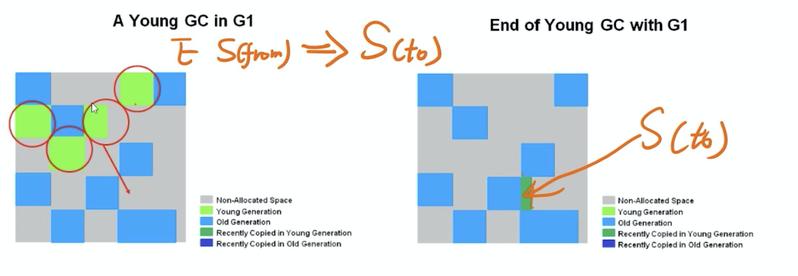

# G1 垃圾收集器

## 基本概念

1. 取消了传统的划分连续的 Eden 区 和 Old 区
2. 使用Region，如果生成的对象 >= 0.5 Region < 1Region 那么就会标记为 H(Humongous) 区，H区是Old区的一种。
3. 如果大于一个 Region，那么就会申请多个连续的 H 区，用于存储
4. remeberset -> 用于记录其他 region 引用当前 region 对象
5. Collections -> 这一次垃圾收集需要清理的region集合。

## GC 过程

 ### Young GC

### Mix GC

G1 中独有的概念

1. 初次标记 -> GCRoot 对象，以及这些Root所在的Region，称为 RootRegion ==STW==
2. RootRegion 扫描所有 old区 ==所有region==，检查**所有**O区的region是否有rset引用这个RootRegion，并标识
3. 并发标记 ->  同 CMS，只不过遍历范围缩小，只需要遍历标识的 O 区
4. 重新标记 -> 同 CMS，只不过用了 SATB ==STW==
5. 清理 -> ==STW==
6. 只选出垃圾较多的 region

## 问题列表

1. RootRegionScan这个阶段是干嘛的？

> 标记出RootRegion指向O区的region，标记这些region是为了降低并发标记的扫描范围，因为并发标记需要扫描GCROOT引用或间接的所有对象，而这些对象一定是在RootRegion出发指向的Region中的。MIXGC中Y区本来就要全扫，所以这里再按照O区过滤下，这样就缩小了扫描范围。该阶段的操作为遍历O区region查询Rset是否有来自RootRegion的，（RootRegion是初始标记得到的）。

2. Rset作用有哪些？

> 上题中的作用是一个，还有个作用是YGC时，O区不GC因而认为O区全为‘GCroot’，需扫描全部O区。有了Rset只需要查看所有Y区region的Rset就知道被哪些O区region跨带引用了，避免了扫描整个O区。

3. G1提高效率的点有哪些？

> 1 重新标记时X区域直接删除。
> 2 Rset降低了扫描的范围，上题中两点。
> 3 重新标记阶段使用SATB速度比CMS快。
> 4 清理过程为选取部分存活率低的Region进行清理，不是全部，提高了清理的效率。

4. 对比CMS，有哪些不同？

> 1 region化的内存结构，采用复制清理的方式，避免了内存碎片。但是这种清理也造成了STW。
> 2 SATB速度更快。
> 3 初始标记，并发标记，重新标记，清理垃圾四个阶段很像，但是G1中有很多标记region的操作，并借助Rset进行了范围的缩小，提高了并发标记的速度。小结下就是初始标记和YGC的STW一起了，提高了效率；并发标记因为rset的设计，扫描范围缩小了，提高了效率；重新标记因为使用了SATB提高了效率；清理虽然造成了STW，但是复制使内存紧凑，避免了内存碎片。同时只清理垃圾较多的region，最大限度的降低了STW时间。