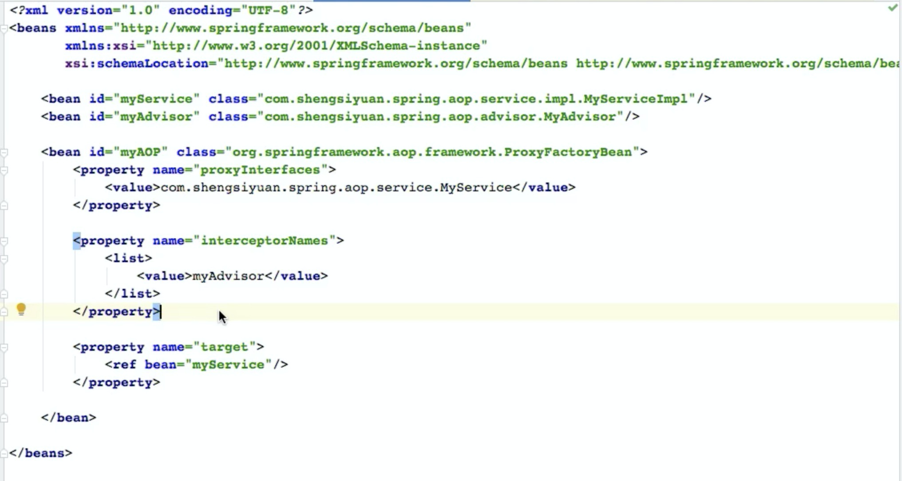

# AOP

## 核心概念

1. Advice 通知：定义在连节点处的行为，围绕方法调用而进行注入
2. Pointcut 切点：确定在哪些连节点处应用通知
3. Advisor 通知器：组合Advice与Pointcut

## AOP的实现

### ProxyFactoryBean

1. target 目标对象：对其进行切面增强
2. proxyInterfaces 代理对象所实现的接口
3. interceptorNames 通知器(Advisor)列表，通知器中包含了 Advice 和 切点 Pointcut
4. 总体来说，就是针对目标对象创建代理对象，将对目标对象方法的调用转到对相应 代理对象方法的调用，并且可以在代理对象方法调用前后执行与之匹配的各个通知器中定义好的方法。



### 3种方式创建目标代理对象

1. JDK动态代理：需要先实现接口。如果目标对象实现了接口，那么Spring就会通过JDK动态代理为目标对象生成代理对象。
2. CGLIB：字节码增强库，如果没有实现接口，可以为目标类生成一个子类
3. ObjenesisCglibAopProxy：基于CGLIB，但是效率更高

### 代理模式

代理模式的作用是：为其他对象提供一种代理以控制对这个对象的访问

在某些情况下， 一个客户不想或者不能直接引用另一个对象，而代理对象可以在客户端和目标对象之间起到中介的作用。

## BeanFactory 和 FactoryBean的区别

FactoryBean也是一个由BeanFactory管理的Bean。BeanFactory会判断当前Bean的实例是不是一个FactoryBean，如果不是，立刻返回；如果是，将会调用FacotryBean的getObject，返回工厂管理的Bean 的实例。这个对象是在运行过程中产生的，而FactoryBean这个实例还是存储在BeanFacotry 中。

BeanFactory是 **Spring IoC 的工厂**，它里面管理着Spring所创建出来的各种Bean对象，当我们在配置文件中生命了某个 bean 的id 后，通过这个 id 就可以获取到与该 id 所对应的实例（可能新建也可能从缓冲中获取）

FactoryBean **本质上也是一个 Bean**，它同其他Bean一样，也是由 BeanFactory所管理和维护的，当然他的实例也会缓存到 Spring 的工厂中（如果是单例），他与普通的 Bean 的唯一区别在于，当Spring创建另一个FactoryBean 的实例后，他接下来会判断当前所创建的Bean是否是一个FactoryBean的实例，如果不是，那么就直接将创建出来的Bean返回给客户端；如果是，那么它会对其进行进一步的处理，根据配置文件所配置的target，advisor与interfaces灯信息，在运行期动态构建出一个类，并生成该类的一个实例，最后将该实例返回给客户端；因此，我们在声明一个FactoryBean时，通过id获取到的并非这个FactoryBean的实例，而是它动态生成出来的一个代理对象（通过三种方式进行生成）。 

## 创建流程

1. 先按照IoC的流程创建对应的 ProxyFactoryBean(FactoryBean接口的实现)，来去配置相应的代理对象相关的信息。
2. 在获取 ProxyFactoryBean 实例时，本质并不是获取到ProxyFactoryBean的对象，而是获取到由ProxyFactoryBean 所返回的那个对象实例。
3. 在整个ProxyFactoryBean 实例的构建与缓存过程中，其流程与普通的Bean对象完全一致。
4. 差别在于，当创建了ProxyFactoryBean对象后，Spring会判断当前所创建的对象是否是一个FactoryBean的实例
5. 如果不是，那么就直接将所创建的对象返回。如果不是，则会进入另一个流程

6. 在进行 **populateBean** 的过程时，会创建出代理对象需要的 Bean（在 xml 文件中进行配置的），判断分支

> if (!(beanInstance instanced FactoryBean)) {
>
> ​	return beanInstance;
>
> }
>

```java
if (mbd.isSingleton()) {
  sharedInstance = getSingleton(beanName, () -> {
    try {
      //返回一个 bean 对象
      return createBean(beanName, mbd, args);
    } catch (Exception e) {
      destroySingleton(beanName);
      throw e;
    }
  })
    //获取到动态代理对象的代码。判断真正获取 bean 对象还是 FactoryBean 生成的动态代理对象。
    bean = getObjectForBeanInstance(sharedInstance, name, beanName, mbd)
}

object = ProxyFactoryBean.getObject();//返回一个代理。获取 bean 对象时可以被调用。
```


7. Spring会根据我们在配置信息中所制定的各种元素，如目标对象是否实现了接口以及Advisor等信息，使用动态代理或者CGLIB等方式为目标对象创建相应的代理对象。

8. 当相应的代理对象创建完毕后，Spring就会通过ProxyFactoryBean的getObject方法，将所创建的对象返回。

9. 对象返回到调用端(客户端)，他本质上是一个代理对象，可以代理对目标对象的访问与调用，这个代理对象对用户来说，就好像一个目标对象一样。
10. 客户在使用代理对象时，可以正常调用目标对象的方法，同时在执行过程中，会根据我们在配置文件中所配置的信息来在调用前后执行额外的附加逻辑

11. completeProxiedInterfaces 这个方法中，添加除了自己实现的 Impl 以外的三个接口

## Spring事务的创建

事务的开启、提交、回滚等则由具体的事物管理器来实现。

`-Dsun.misc.ProxyGenerator.saveGeneratedFiles=true`进一步调试动态代理在 AOP 中的 应用  