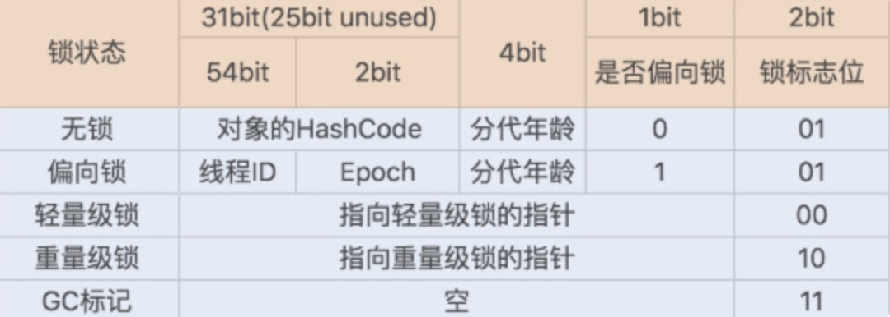
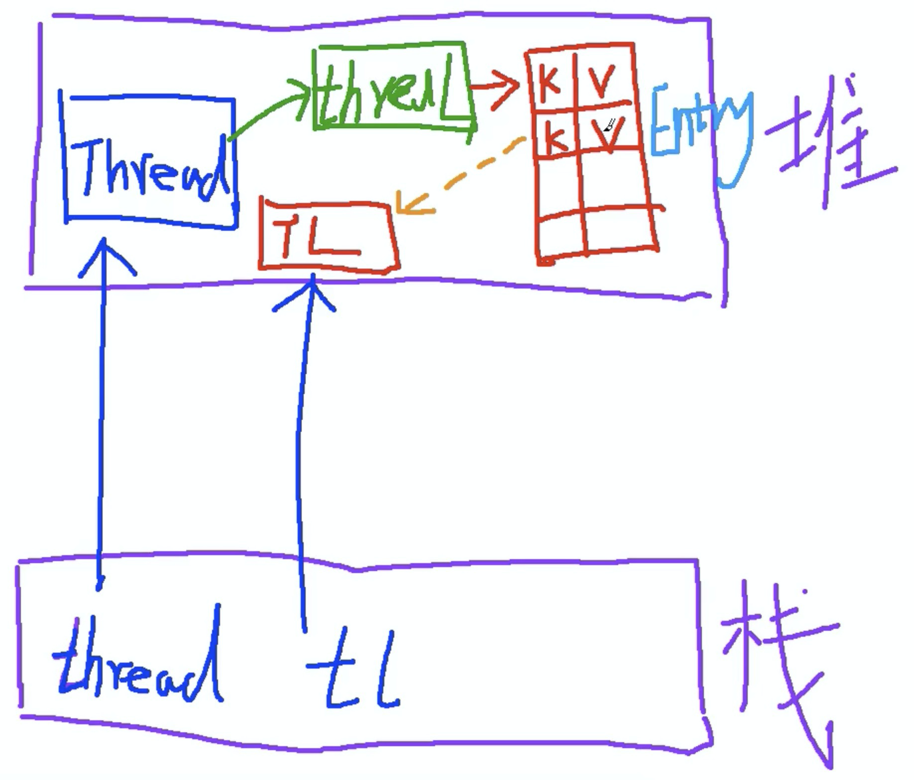

# 线程
## 创建方式
### Thread 和 Runnable
当只想使用 `run()` 方法或者不使用 Thread 类中其他的方法时，则不需要使用继承 `Thread` 类的方式。

线程的优先级初始为 5，最高优先级为10，最小为1

### Wait 和 Notify
#### Wait
Wait 可以让当前线程进行等待，直到另一个线程调用了当前对象的 notify 或者 notifyAll 方法。
1. 调用了当前对象的 notify 方法，不一定会唤醒哪一个等待的线程
2. notifyall
3. 一些线程打断了这个正在 wait 的线程
4. 达到了超时时间

因此,首先需要拥有对象的 monitor，其次要在 while 循环中使用，防止线程假醒
```java
    synchronized(obj) {
        while(<condition>) {
            obj.wait(timeout);
            //Perform action appropriate to condition
        }
    }
```

`wait(0)` 表示一直进行等待，==没有超时时间==。当前线程必须拥有这个对象的锁，当进行 `wait` 时，当前线程就会释放当前对象的锁对象。==这个方法应该只能被拥有这个对象锁的线程进行调用。==

而 `Thread.sleep()` 并不会放弃锁的拥有权。

这段代码由于没有获取到 `object` 对象的锁，因此会抛出异常。因此，只有使用同步代码块才会拥有锁
```java
    public static void main(String[] args) throws InterruptedException {
        Object object = new Object();
        object.wait();
    }
    
Exception in thread "main" java.lang.IllegalMonitorStateException
	at java.lang.Object.wait(Native Method)
	at java.lang.Object.wait(Object.java:502)
	at com.tju.newthread.MyTest1.main(MyTest1.java:6)
```
#### Notify
唤醒等待对象monitor的线程，如果有多个线程等待这个对象，那么从多个等待的线程中随机选择一个唤醒。被唤醒的线程直到获取到这个对象的锁，才会进行执行。被锁的持有者调用这个方法。
1. 在执行同步实例方法
2. 执行 synchronized 语句快
3. 对于 Class 类型，执行 类中的 static 方法的 synchronized 方法

#### NotifyAll
会唤醒在这个对象的 monitor 上等待的所有线程。

区别：NotifyAll会唤醒所有线程，但是这些线程还是会竞争 monitor

#### 总结
关于wait 与 notify 和 notifyAll方法的总结：
1. 当调用 wait 时，首先需要确保调用了 wait 方法的线程持有了对象的锁。
2. 当调用 wait 后，该线程就会释放掉这个对象的锁，然后进到等待状态。(wait set)
3. 当线程调用了 wait 后进入等待状态时，它就可以等待其他线程调用相同对象的 notify 或者 notifyAll方法使得自己被唤醒。
4. 一旦，这个线程被其他线程唤醒后，该线程就会与其他线程一同开始竞争这个对象的锁(公平竞争)；只有当该线程获取到了这个对象的锁后，线程才会继续向下执行。
5. 调用 wait 方法的代码片段需要放在一个 synchronized 块或是 synchronized方法中，这样才可以确保线程在调用 wait方法前获取到了对象的锁。
6. 当调用对象的 notify 方法时，他会随机唤醒该对象等待集合 wait set 中的任意一个线程。当某个线程被唤醒后，他就会与其他线程一同竞争对象锁
7. 当调用对象的 notifyAll 方法时，他会唤醒该对象等待集合中的所有线程，这些线程被唤醒后，又会开始竞争对象的锁。
8. 在某一时刻，只有唯一一个线程可以拥有对象的锁。

```java
public class Test {
    public synchronized void method1() {
        
    }
    
    public synchronized void method2() {
        
    }
}

Test test = new Test();

test.method1时不可以同时调用test.method2
```
## 生产者消费者的多线程实现
```java
package com.tju.newthread;

public class MyClient {
    public static void main(String[] args) {
        MyObject myObject = new MyObject();

        Thread increaseThread = new IncreaseThread(myObject);
        Thread decreaseThread = new DecreaseThread(myObject);

        increaseThread.start();
        decreaseThread.start();
    }
}

class MyObject {
    private int counter;

    public synchronized void increase() {
        while (counter != 0) {
            try {
                wait();
            } catch (InterruptedException e) {
                e.printStackTrace();
            }
        }
        counter++;
        System.out.println(counter);

        notify();
    }

    public synchronized void decrease() {
        while (counter == 0) {
            try {
                wait();
            } catch (InterruptedException e) {
                e.printStackTrace();
            }
        }

        counter--;
        System.out.println(counter);
        notify();
    }
}

class IncreaseThread extends Thread {
    private MyObject myObject;
    public IncreaseThread (MyObject myObject) {
        this.myObject = myObject;
    }

    @Override
    public void run() {
        for (int i = 0; i < 30; i++) {

            try {
                Thread.sleep((long)Math.random() * 1000);
            } catch (InterruptedException e) {
                e.printStackTrace();
            }
            myObject.increase();
        }
    }
}

class DecreaseThread extends Thread {
    private MyObject myObject;

    public DecreaseThread(MyObject myObject) {
        this.myObject = myObject;
    }

    @Override
    public void run() {
        for (int i = 0; i < 30; i++) {
            try {
                Thread.sleep((long)Math.random() * 1000);
            } catch (Exception e) {
                e.printStackTrace();
            }
        }

        myObject.decrease();
    }
}
```

## Synchronize 关键字
如果某一个对象中，有若干个`synchronized`方法，某一时刻，只有一个 `synchronized`方法会被执行。因为当前对象只有一把锁。

当我们使用 synchronized 关键字来修饰==代码块==时，字节码层面上是通过 monitorenter 与 moniterexit 指令来实现锁的获取与释放动作。当线程进入到 monitorenter指令后，线程会持有 mointor 对象，退出 monitorenter 指令后，线程将会释放 monitor 对象。

修饰方法时，方法的标志位就会增加一个 ACC_SYNCHRONZIED 关键字。JVM 使用了 ACC_SYNCHRONIED 访问标志区分一个方法是否为同步方法；当方法被调用时，调用指令会检查该方法是否拥有这个标志。如果有，那么执行线程将会==先持有==方法所在对象的monitor对象，然后再去执行方法体；在该方法执行期间，其他任何线程均无法再获取这个monitor对象，当线程执行完该方法后，他会==释放==掉这个 monitor 对象。

JVM中的同步是基于进入与退出monitor对象来实现的，每个对象实例都会有一个 monitor 对象，monitor对象会和对象一同创建并销毁。monitor 对象是由 C++ 来实现的。当多个线程同时访问一段同步代码时，这些线程会被放到一个 ==EntryList== 集合汇中。处于阻塞状态的线程都会被放到该列表当中。接下来，当线程获取到对象的 monitor时，monitor是依赖于底层操作系统的 `mutex` lock来实现互斥的，线程获取`mutex`成功，则会持有该`mutex`，这时，其他线程就无法再获取到该`mutex`

如果线程调用了 wait 方法，那么该线程就会释放掉所持有的 mutex，并且该线程进入到 waitset 中，等待下一次被其他线程调用 notify/notifyAll 唤醒。如果当前线程顺利执行完毕方法，那么它也会释放掉所持有的 `mutex`

总结：同步锁在这种实现方式中，因为 monitor 依赖于底层的操作系统实现，这就存在用户态与内核态之间的切换，所以会增加性能开销。通过对象互斥锁的概念来保证共享数据操作的完整性。每个对象都对应于一个可称为互斥锁的标记，这个标记用于保证在任何时刻，只能有一个线程访问该对象。

那些处于 EntryList 与 WaitSet中的线程均处于阻塞状态，阻塞操作是由操作系统来完成的，在linux下通过==pthread_mutext_lock==函数实现的，线程被阻塞后便进入到内核调度状态，这回导致系统在用户态与内核态之间来回切换，严重影响锁的性能。

解决上述问题的办法便是自旋。其原理是：当发生 monitor 的争用时，若 owner 能在很短的时间内释放掉锁，则那些争用的线程就可以稍微等待一下（自旋），在owner线程释放锁之后，争用线程可能会理解获取到锁，从而避免了系统阻塞。不过当 owner 运行的时间超过了临界值后，争用线程自旋一段时间后依然无法获取到锁，这时争用线程则会停止自旋从而进入到阻塞状态。所以总体的思想是：先自旋，不成功再进行阻塞，尽量降低阻塞的可能性，这对那些执行时间短的代码块来说有极大的性能提升。显然，自旋在多处理器上才有意义。

### 互斥锁的属性
1. PTHREAD_MUTEX_TIMED_NP: 这是缺省值，也就是普通值，当一个线程加锁以后，其余请求锁的线程将会形成一个等待队列。并且在解锁后按照优先级获取到锁。这种策略可以确保资源分配的公平性。
2. PTHREAD_MUTEX_RECURSIVE_NP:  嵌套锁，允许一个线程对同一个锁成功获取多次，并通过unlock解锁。如果是不同线程请求，则在加锁线程解锁时重新进行竞争。 
3. PTHREAD_MUTEX_ERRORCHECK_NP: 检测锁。如果一个线程请求同一个锁，则返回 EDEADLK，否则与 PHTREAD_MUTEX_TIMED_NP类型动作相同，这样就保证了当不允许多次加锁时不会出现最简单情况下的死锁。
4. PTHREAD_MUTEX_ADAPTIVE_NP:适应锁，动作最简单的锁类型，仅仅等待解锁后重新竞争。 

objectMonitor.hpp + objectMonitor.cpp

先进入 waitset 然后进入entrylist，这两个都是双向链表。waitset这个集合仅仅存放显示的调用 wait 方法的线程。如果没有调用 wait 方法，那么就会直接进入 entrylist中。

从JDK1.5之前，我们若想实现线程同步，只能通过 synchronized关键字着一种方式来达成；底层，Java也是通过 synchronzed关键字来做到数据的原子性维护的；synchronized关键字是JVM实现的一种内置锁，这种锁的获取与释放都是由JVM帮助我们隐式实现的。

从JDK1.5开始，并发包引入了Lock锁，Lock同步锁是基于Java实现的，因此锁的获取与释放都是通过Java代码来实现与控制的。 然而synchronized是基于底层操作系统的mutex lock 来实现的，每次对锁的获取与释放都会带来用户态和内核态之间的切换。这种切换会极大的增加系统的负担。因此，在并发量较高时，也就是说锁的竞争比较激烈时，synchronized锁在性能上的表现就非常差。

从JDK1.6开始，synchronized锁的实现发生了很大变化，JVM引入了相应的优化手段来提升synchronized锁的性能，这种提升涉及到偏向锁、轻量级锁和重量级锁。从而减少锁的竞争所带来的用户态与内核态之间的切换。这种锁的优化实际上是通过Java对象头的一些标志位去实现的。对于锁的访问与改变，实际上都与Java对象头息息相关。

从JDK1.6开始，对象实例在堆当中会被划分为三个部分：对象头、实例数据与对齐填充。对象头主要也是由三块内容构成。



1. Mark Word：记录了对象、锁以及垃圾回收相关的信息，在64位JVM中，其长度也是64bit，对于synchrd锁来说，锁的升级主要都是通过Mark Word 中的锁标志位与是否是偏向锁标志位来达成的。synchronized关键字所对应的锁都是先从偏向锁开始，随着锁竞争不断升级，逐步演化至轻量级锁，最后变成重量级锁。
    1. 无锁标记
    2. 偏向锁标记：针对于一个线程来说，它的主要作用就是优化同一个线程多次获取一个锁的情况；如果一个synchronized方法被一个线程访问，那么这个方法所在的对象就会在其Mark Word中的将偏向锁进行标记，同时还会有一个字段来存储该线程的ID，当这个线程再次访问同一个synchronized方法时，他会检查这个对象的Mark Word的偏向锁标记以及是否指向了其线程ID，如果是的话，那么该线程就无需再去进入管程了，而是直接进入到该方法体中。
    3. 轻量级锁标记：若第一个线程已经获取到了当前对象的锁，这时第二个线程又开始尝试争抢该对象的锁，由于该对象的锁已经被第一个线程获取到，因此它是偏向锁；而第二个线程在争抢时，会发现该对象头中的Mark Word已经是偏向锁，但里面存储的线程ID并不是自己的(第一个线程的)。那么他会进行CAS，从而获取到锁，这里面会有两种情况：
        1. 获取锁成功：那么他会直接将Mark Word 中的线程ID由第一个线程变为自己(偏向锁标记位保持不变),这样该对象依然会保持偏向锁的状态
        2. 获取锁失败：则表示这时可能会有多个线程同时在尝试争抢该对象的锁，那么这时偏向锁就会进行升级，升级为轻量级锁。
        3. 自旋锁：若自旋失败，那么锁就会转化为重量级锁，这种情况下， 无法获取到锁的线程都会进入到monitor(即内核态)
    4. 重量级锁标记：线程最终从用户态进入内核态
    5. GC标记
2. 指向类的指针
3. 数组长度 

### 锁优化

#### 锁消除
```java
package com.tju.newthread;

/**
 *  编译器对于锁的优化措施：
 *  锁消除技术
 *  JIT编译器(Just In TIme 编译器)可以在动态编译同步代码时，使用一种叫做逃逸分析的技术，来通过该项技术判别程序中所使用的锁对象
 *  是否只被一个线程所使用，而没有散布到其他线程当中，如果情况就是这样的话，那么JIT编译器在编译这个同步代码时就不会生成synchronized关键字
 *  所标识的锁的申请与释放机器码，从而消除了锁的使用流程
 */
public class MyTest2 {
//    private Object object = new Object();

    public void method1() {
        Object object = new Object();

        synchronized (object) {
            System.out.println("hello world");
        }
    }
}
```

#### 锁粗化
```java
package com.tju.newthread;

/**
 * 进入到这个方法中，object对象在执行method中的每行代码都会发生竞争
 * 
 * 锁粗化：
 * JIT编译器在执行动态编译时，若发现前后相邻的synchronized块使用的是同一个锁对象，那么它就会把这几个synchronized块给合并为一个较大的
 * 同步块，这样做的好处在于线程在执行这些代码时，就无须频繁申请与释放锁了，从而达到申请与释放锁一次，就可以执行完全部的同步代码块，从而提升了性能。
 */

public class MyTest3 {
    private Object object = new Object();

    public void method() {
        synchronized (object) {
            System.out.println("hello");
        }

        synchronized (object) {
            System.out.println("welcome");
        }

        synchronized (object) {
            System.out.println("person");
        }
    }
}
```

 #### 死锁

1. 使用 jvisualvm检测死锁。
2. jps -l 命令检查线程 id，然后使用 jstack id 可以检查当前线程整体的运行情况。

```java
package com.tju.newthread;

/**
 * 死锁：线程1等待线程2互斥持有的资源，而线程2也在等待线程1互斥持有的资源。两个线程都无法继续执行。两个线程的场景。
 * 活锁：线程持续重试一个总是失败的操作，导致无法继续执行。一个线程的场景
 * 饿死：线程一直被调度器延迟访问其赖以执行的资源，也许是调度器先于低优先级的线程而执行高优先级的线程，同时
 * 总是会有一个高优先级的线程可以执行。饿死也叫做无限延迟。
 */

public class DeadLock {
    private Object lock1 = new Object();
    private Object lock2 = new Object();

    public void myMethod1() {
        synchronized (lock1) {
            synchronized (lock2) {
                System.out.println("myMethod1 invoked");
            }
        }
    }

    public void myMethod2() {
        synchronized (lock2) {
            synchronized (lock1) {
                System.out.println("myMethod2 invoked");
            }
        }
    }

    public static void main(String[] args) {
        DeadLock deadLock = new DeadLock();

        Runnable runnable1 = () -> {
            while (true) {
                deadLock.myMethod1();

                try {
                    Thread.sleep(100);
                } catch (Exception e) {
                    e.printStackTrace();
                }
            }
        };

        Runnable runnable2 = () -> {
            while (true) {
                deadLock.myMethod2();

                try {
                    Thread.sleep(200);
                } catch (Exception e) {
                    e.printStackTrace();
                }
            }
        };

        Thread t1 = new Thread(runnable1, "myThread1");
        Thread t2 = new Thread(runnable2, "myThread2");

        t1.start();
        t2.start();
    }
} 
```

##  Lock

```java
package thread;

/**
 * 关于 Lock 与 synchronized关键字在锁的处理上的重要差别：
 * 1. 锁的获取方式：前者是通过程序代码的方式由开发者手工获取，后者是通过JVM获取
 * 2. 具体实现方式：前者是通过Java代码的方式来实现。后者是通过JVM底层实现
 * 3. 锁的释放方式：前者务必通过 unlock()方法在finally块中手工释放。后者是通过JVM释放
 * 4. 锁的具体类型：前者提供了多种如公平锁、非公平锁，后者与前者均提供了可重入锁，synchronized是非公平锁
 */

import java.util.concurrent.locks.Lock;
import java.util.concurrent.locks.ReentrantLock;

public class MyTest1 {
    //可重入锁
    private Lock lock = new ReentrantLock();

    public void myMethod1() {
        try {
            lock.lock();
            System.out.println("myMethod1 invoked");
        } catch (Exception e) {
            e.printStackTrace();
        } finally {
            lock.unlock();
        }
    }

    public void myMethod2() {
        try {
            lock.lock();
            System.out.println("myMethod2 invoked");
        } catch (Exception e) {
            e.printStackTrace();
        } finally {
            lock.unlock();
        }
    }

    public static void main(String[] args) {
        MyTest1 myTest1 = new MyTest1();

        Thread t1 = new Thread(() -> {
            for (int i = 0; i < 10; ++i) {
                myTest1.myMethod1();

                try {
                    Thread.sleep(2000);
                } catch (Exception e) {
                    e.printStackTrace();
                }
            }
        });

        Thread t2 = new Thread(() -> {
            for (int i = 0; i < 10; i++) {
                myTest1.myMethod2();

                try {
                    Thread.sleep(2000);
                } catch (Exception e) {
                    e.printStackTrace();
                }
            }
        });

        t1.start();
        t2.start();
    }
}
```

#### Condition

传统上，我们可以通过synchronized关键字 + wait + notify 来实现多个线程之间的协调与通信，整个过程都是由JVM来帮助我们实现的，开发者无需了解底层的实现细节。

从JDK 5开始，并发包提供了 Lock，Condition(await 与 signal)来实现多个线程之间的协调与通信，整个过程都是由开发者来控制的。相比于传统方式，更加灵活，功能也更加强大。

Thread.sleep与await的本质区别：sleep方法==本质上不会释放锁，而await会释放锁，并且在signal之后，还需要重新获取到锁才能继续执行==。

```java
package thread;

import java.util.Arrays;
import java.util.concurrent.locks.Condition;
import java.util.concurrent.locks.Lock;
import java.util.concurrent.locks.ReentrantLock;
import java.util.stream.IntStream;

public class MyTest2 {
    public static void main(String[] args) {
        BoundedContainer boundedContainer = new BoundedContainer();

        IntStream.range(0, 10).forEach(i -> new Thread(() -> {
            try {
                boundedContainer.put("hello");
            } catch (Exception e) {
                e.printStackTrace();
            }
        }).start());

        IntStream.range(0, 10).forEach(i -> new Thread(() -> {
            try {
                boundedContainer.take();
            } catch (Exception e) {
                e.printStackTrace();
            }
        }).start());
    }
}

class BoundedContainer {
    private String[] elements = new String[10];
    private Lock lock = new ReentrantLock();
    private Condition notEmptyCondition = lock.newCondition();
    private Condition notFullCondition = lock.newCondition();

    //elements数组中已有的元素个数
    private int elementCount;
    private int putIndex;
    private int takeIndex;

    public void put(String putStr) throws Exception {
        //线程之间实现互斥
        this.lock.lock();
        try {
            while(elementCount == elements.length) {
                notFullCondition.await();
            }
            elements[putIndex] = putStr;
            if (++putIndex == elements.length) putIndex = 0;
            ++elementCount;
            System.out.println("put method: " + Arrays.toString(elements));

            notEmptyCondition.signal();
        } finally {
            this.lock.unlock();
        }
    }

    public String take() throws Exception {
        this.lock.lock();
        try {
            while (elementCount == 0) notEmptyCondition.await();
            String result = elements[takeIndex];
            elements[takeIndex] = null;
            if(++takeIndex == elements.length) takeIndex = 0;
            --elementCount;
            notFullCondition.signal();
            System.out.println("take method: " + result);
            return result;
        } finally {
            this.lock.unlock();
        }
    }
}
```

## Volatile 关键字

1. 实现 long/double 类型变量的原子操作：8个字节64位，32位机器进行分批次写入，如先写入低32位再写入高32位。

2. 防止指令重排序

3. 实现变量的可见性：使用 volatile 关键字修饰的变量不会再从寄存器中进行读取。 

4. volatile可以确保对变量写操作的原子性，但不具备排他性。另外重要的一点在于：==使用锁可能会导致线程的上下文切换，但是使用volatile并不会出现这种情况==，因此对于volatile的使用不能在右侧出现运行，必须是原子操作。只能保证读写这个数据的原子性。

5. volatile与锁相似的地方有两点：

   1. 确保变量的内存可见性
   2. 防止指令重排序

6. 如果要实现volatile写操作的原子性，那么在等号右侧的赋值变量中就不能出现被多线程所共享的变量。哪怕这个变量也是个volatile也不可以

7. 防止指令重排序与实现变量的可见性都是通过一种手段来实现的：内存屏障(memory barrier)，

   1. Release Barrier：防止==下面的volatile与上面==的所有操作的指令重排序。
   2. Store Barrier：重要作用是刷新处理器缓存，结果是可以确保该存储屏障之前的一切操作所生成的结果对于其他处理器来说都是可见的
   3. Load Barrier: 可以刷新处理器缓存，同步其他处理器对该 volatile 变量的修改结果
   4. Acquire Barrier: 可以防止上面的volatile读取操作与==下面==的所有操作语句的指令重排

   > 内存屏障(Release Barrier, 释放屏障)
   >
   > Volatile boolean v = false; //写入操作
   >
   > 内存屏障(Store Barrier 存储屏障)
   >
   > 
   >
   > 内存屏障(Load Barrier, 加载屏障)
   >
   > boolean v1 = v;
   >
   > 内存屏障(Acquire Barrier, 获取屏障)

8. 对于volatile关键字变量的读写操作，本质上都是通过内存屏障执行的。内存屏障兼具了两方面能力，一个是防止指令重排，另一个是实现变量内存的可见性。

9. 对于读取操作来说，volatile可以确保该操作与其后续的所有读写操作都不会进行指令重排序。

10. 对于修改操作来说，volatile可以确保该操作与其上面的所有读写操作都不会进行质量重排序。

11. volatile与锁的一些比较：

    1. 锁同样具备变量内存可见性与防止指令重排序的功能。

       > mointerenter
       >
       > 内存屏障(Acquire Barrier)
       >
       > ....
       >
       > 内存屏障(Release Barrier)
       >
       > mointierexit

### Java内存模型以及 happen-before

1. 变量的原子性问题
2. 变量的可见性问题
3. 变量修改的时序性问题
4. happen-before重要规则：
   1. 顺序执行规则：在单个线程当中，该线程的每个动作都 happen-before 它后面的动作。如果 A 和 B 之间没有任何关系，就会允许指令重排序。如果有关系，那么一定遵循顺序执行规则。
   2. 隐式锁(monitor)规则：unlock happen-before lock，之前的线程对于同步代码块的所有执行结果对于后续获取锁的线程来说都是可见的。
   3. volatile读写规则：对于一个volatile变量的写操作一定会happen-before后续对该变量的读操作。
   4. 多线程的启动规则：Thread对象的start方法happen-before该线程run方法中的任何一个动作，包括在其中启动的任何子线程。
   5. 多线程的终止规则：一个线程启动了一个子线程，并且调用了子线程的join方法等待其结束。那么当子线程结束后，父线程接下来的所有操作，都可以看到子线程run方法中的执行结果。
   6. 线程的中断规则：可以调用interrupt方法来终端线程，这个调用happen-before对该对线程中断的检查。

### 辅助工具

#### CountDownLatch 

```java
package thread;

import java.util.concurrent.CountDownLatch;
import java.util.stream.IntStream;

public class MyTest3 {
    public static void main(String[] args) {
        CountDownLatch countDownLatch = new CountDownLatch(3);
      //永远等待，不会达到0
      //CountDownLatch countDownLatch = new CountDownLatch(3);
        IntStream.range(0, 3).forEach(i -> new Thread(() -> {
            try {
                Thread.sleep(2000);

                System.out.println("hello");
            } catch (Exception e) {
                e.printStackTrace();
            } finally {
                //如果执行抛出异常导致数量无法到0，就会导致永远阻塞。因此一定要讲countDown放入finally中
                countDownLatch.countDown();
            }
        }).start());

        System.out.println("启动子线程完毕");

        try {
            countDownLatch.await(200, TimeUnit.SECONDS);
        } catch (Exception e) {
            e.printStackTrace();
        }

        System.out.println("主线程执行完毕");
    }
}
```

#### CyclicBarrier

```java
package thread;

import java.util.Random;
import java.util.concurrent.CyclicBarrier;

public class MyTest4 {
    public static void main(String[] args) {
        CyclicBarrier cyclicBarrier = new CyclicBarrier(3);

        for (int i = 0; i < 3; ++i) {
            new Thread(() -> {
                try {
                    Thread.sleep((long)(Math.random() * 2000));
                    int randomInt = new Random().nextInt(500);
                    System.out.println("hello" + randomInt);

                    cyclicBarrier.await();
                    System.out.println("world" + randomInt);
                } catch (Exception exception) {
                    exception.printStackTrace();
                }
            }).start();
        }
    }
}
```

```java
package thread;

import java.util.Random;
import java.util.concurrent.CyclicBarrier;

public class MyTest4 {
    public static void main(String[] args) {
        CyclicBarrier cyclicBarrier = new CyclicBarrier(3);

        for (int i = 0; i < 3; ++i) {
            //CyclicBarrier可以重复运行
            for (int j = 0; j < 5; ++j) {
                new Thread(() -> {
                    try {
                        Thread.sleep((long)(Math.random() * 2000));
                        int randomInt = new Random().nextInt(500);
                        System.out.println("hello" + randomInt);
    
                        cyclicBarrier.await();
                        System.out.println("world" + randomInt);
                    } catch (Exception exception) {
                        exception.printStackTrace();
                    }
                }).start();
            }
        }
    }
}
```

内部维护两个变量: parties 和 count，count = 0 时，会重新将 count = parties 以便下次继续使用。有两个构造方法，Runnable

参数的目的是每次count = 0 执行 Runnable 的命令。

关于 CyclicBarrier的底层执行流程：

1. 初始化 CyclicBarrier中的各种成员变量，包括 parties、count以及Runnable(可选)
2. 当调用 await()方法时，底层会先检查计数器是否已经归零，如果是的话，那么就首先执行可选的Runnable，接下来开始下一个Generation
3. 在下一个分代中，将会重置count值为parties，并且创建新的Generation实例
4. 同时会调用 Condition的signalAll方法，唤醒所有在屏障前面等待的线程，让其开始继续执行。
5. 如果计数器没有归零，那么当前的调用线程会通过Condition的await方法，在屏障前进行等待。
6. 以上所有执行流程均在lock锁的控制范围内，不会出现并发情况。

## CAS

1. synchronized关键字与Lock等锁机制都是悲观锁：无论做何种操作，首先都需要先上锁，接下来再去执行后续的操作，从而确保了接下来的所有操作都是由当前线程执行。
2. 乐观锁：线程在操作之前不会做任何预先的处理，而是直接去执行；当在执行变量更新的时候，当前线程需要有一种机制来确保当前被操作的变量是没有被其他线程修改的。


## ThreadLocal

**本质上**，ThreadLocal是通过空间来换取时间，从而实现每个线程当中都会有一个变量的副本，这样每个线程都会操作该副本，从而完全规避了多线程的并发问题。

```java
public class Test {
		public static void main(String[] args) {
      ThreadLocal<String> threadLocal = new ThreadLocal();
  
  		threadLocal.set("hello");
  		System.out.println(threadLocal.get());
    }
}
```

**为什么声明为静态**：静态代表全局，用static修饰代表当前类所有的实例都可以访问到静态的ThreadLocal。

==流程==：

1. 将threadLocal作为K，set的值作为V，组成的一个Entry，而这个Entry又是被包含在一个ThreadLocalMap中

2. 同时，对于ThreadLocal来说，Thread维护了一个 threadLocals的属性，将Thread和ThreadLocal关联了起来。

   ```java
   /**
   * Thread.类
   */
   ThreadLocal.ThreadLocalMap threadLocals = null;
   ```

### 四种引用

1. 强引用(Strong): 以下三种都会继承一个 Reference 的类
2. 软引用(Soft): 一个对象被一个软引用指向，内存不够时，进行GC时就会被回收。如果空间够，则不会回收
3. 弱引用(Weak): 下一次GC一定会被回收，防止内存泄漏。前提是这个对象没有被一个强引用所指向。
4. 虚引用(Phantom): 并不表示实际指向，而是提供一个引用队列。

### 内存布局



如果 K 是一个强引用，那么一旦某个场景，持有TL的对象不再需要TL，那么 tl 就会不再指向TL，但是此时，K 中有一个强引用指向了 TL，此时 TL 永远也得不到释放。同时 Entry 和 Entry 中的数据也不会释放，会持续增加。而由于 tl 已经不再指向 TL，因此这个 TL 永远也不会被访问到。==造成内存泄漏。==

如果是一个弱引用，某一个持有 TL 的对象消亡了，因此 tl 的引用也会被回收。当GC时，发现TL只被一个弱引用所指向，因此会==回收掉TL==。此时指向这个 TL的 K就变成了 null；对于 K 为 null，V 还存在的值，**set 和 get时，就会remove掉这些 K 为 null 的字段**

不需要时，需要显示的移除掉。可以避免内存泄露。

```java
public class Test {
  private static final ThreadLocal<String> t1 = new ThreadLocal();
  
}

try {
  //逻辑
} finally {
  //不需要时，移除掉指针并且删除 key = null 的Entry中的字段。
  t1.remove();
}
```

```java
ThreadLocalMap getMap(Thread t) {
        return t.threadLocals;
    }
```


