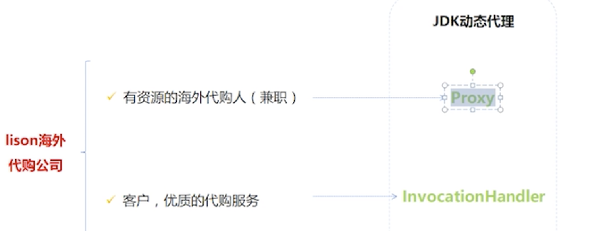

# Java 实现代理的两种方式
* 静态代理
* 动态代理

## 代理模式
* 给目标对象提供一个代理对象，并且由代理对象控制对目标对象的引用
* 目的：
    * 通过代理对象进行对目标对象的增强
    * 防止直接访问目标对象对系统的不必要性

* 三大要素：
    * 接口，公共的方法
    * 真实的被代理的对象，对象自己的实现
    * 代理者，代理者要 **持有被代理的对象的实例**
## 静态代理
### 基于继承的实现
**代理对象继承目标对象，重写目标对象中的方法**
* 查询需求
```java
package com.tju.proxy.dao;

public class UserDaoImpl {
    public void query(String name) {
        System.out.println("query name: " + name);
    }
}
```

* 添加日志需求，继承 `UserDaoImpl`
```java
package com.tju.proxy.proxy;

import com.tju.proxy.dao.UserDaoImpl;

public class LogUerProxy extends UserDaoImpl {
    @Override
    public void query(String name) {
        System.out.println("log" + name);
        super.query(name);
    }
}
```

* 问题，如果再来一个同样的时间记录的需求，应该怎么办

### 基于接口的代理模式实现，聚合
**目标对象和代理对象实现同一个接口，并且代理对象中包含接口对象**
* 生成一个接口
```java
package com.tju.proxy.dao;

public interface UserDaoInterface {
    public void query(String name);
}
```
* 实现接口中的方法
```java
package com.tju.proxy.dao;

public class UserDaoImpl implements UserDaoInterface {
    public void query(String name) {
        System.out.println("query name: " + name);
    }
}
```
* 日志代理生成，同样实现接口，并维护一个 `interface` 类型的对象，便于联合处理
```java
package com.tju.proxy.proxy;

import com.tju.proxy.dao.UserDaoInterface;

public class LogUserProxyInterface implements UserDaoInterface {
    private UserDaoInterface userDaoInterface;

    public LogUserProxyInterface(UserDaoInterface userDaoInterface) {
        this.userDaoInterface = userDaoInterface;
    }

    @Override
    public void query(String name) {
        System.out.println("log: " + name);

        userDaoInterface.query(name);
    }
}
```
* 日期代理生成
```java
package com.tju.proxy.proxy;

import com.tju.proxy.dao.UserDaoInterface;

public class TimeUserProxyInterface implements UserDaoInterface {

    private  UserDaoInterface userDaoInterface;

    public TimeUserProxyInterface(UserDaoInterface userDaoInterface) {
        this.userDaoInterface = userDaoInterface;
    }

    @Override
    public void query(String name) {
        System.out.println("time: " + name);

        userDaoInterface.query(name);
    }
}
```
* 测试类,从中可以看出维护一个 `interface` 类型的对象的好处
```java
public static void main(String[] args) {
    UserDaoInterface userDaoInterface = new UserDaoImpl();
    UserDaoInterface logProxy = new LogUserProxyInterface(userDaoInterface);
    UserDaoInterface timeProxy = new TimeUserProxyInterface(logProxy);

    timeProxy.query("michael");
    }
```

### 缺点
* 生成的代理类过多
* 并且代理的逻辑不灵活，一个类只能处理一个方法
* 违反了**开闭原则**
    * 程序对外扩展开放，对修改关闭
    * 希望通过添加新模块解决需求，而不是增加代码
    * 

## 动态代理

* 动态代理类的实现：内部维护了一个 `Object` 对象，实际使用的时候通过该类的构造方法传递进来一个对象；
* 此外此类还实现了 `invoke` 方法，其中的 `method.invoke()` 方法就是调用被代理对象将要执行的方法，方法参数是 `object`，表示该方法从属于 `object`
* 第一个参数 `proxy` 一般用不上，代理本身
* `getProxyInstance()` 返回一个` $Proxy0`对象;必须传入一组被代理对象的所有接口；最后一个参数要求必须传入一个`handler`,以便调用`invoke()`方法 
```java
package com.tju.proxyDemo.proxy;

import java.lang.reflect.InvocationHandler;
import java.lang.reflect.Method;

public class DynamicSubject implements InvocationHandler {
    private Object object;

    public DynamicSubject(Object object) {
        this.object = object;
    }
    
    //Proxy 获取动态代理的对象，需要用加载这个被代理对象的类加载器进行加载，同时传入他的所有实现的接口
    //最后传入 this 当前对象，也是一个InvocationHandler对象；Proxy生成的是代理对象，代理如何进行操作，要靠 InvocationHandler实现
    public Object getProxyInstance() {
        return Proxy.newProxyInstance(fatory.getClass().getClassLoader(), fatory.getClass().getInterfaces(), this);
    }
		//静态代理中，直接访问被代理对象的方法，在这里，使用反射拿到被代理的方法
    @Override
    public Object invoke(Object proxy, Method method, Object[] args) throws Throwable {
        System.out.println("before calling: " + method);
        method.invoke(object, args);
        System.out.println("after calling: " + method);

        return null;
    }
}

```

### 步骤总结
1. 创建一个实现`InvocationHandler`接口的动态代理类，必须实现其`invoke`方法
2. 创建被代理的类以及接口
3. 通过 `Proxy`的静态方法`newInstance(ClassLoader, Interfaces, Handler)`生成被代理类的对象
4. 调用方法

#### JDK动态代理不足

JDK动态代理的代理类字节码在创建时，需要实现业务实现类所实现的接口作为参数。如果业务实现类是没有实现接口而是直接定义业务方法的话，就无法使用JDK动态代理了。(JDK动态代理重要特点是代理接口) 并且，如果业务实现类中新增了接口中没有的方法，这些方法是无法被代理的（因为无法被调用）。

==动态代理只能对接口产生代理，不能对类产生代理。==

## 基于CGlib 技术动态代理代理类实现 (基于继承)

Cglib是针对类来实现代理的，他的原理是对代理的目标类生成一个子类，并覆盖其中方法实现增强，因为底层是基于创建被代理类的一个子类，所以它避免了JDK动态代理类的缺陷。

但因为采用的是继承，所以不能对final修饰的类进行代理。final修饰的类不可继承。

### 导入maven 依赖

cglib 是基于asm 字节修改技术。导入 cglib 会间接导入 asm, ant, ant-launcher 三个jar 包。

```javascript
<!-- cglib 动态代理依赖 begin -->
 <dependency>
   <groupId>cglib</groupId>
   <artifactId>cglib</artifactId>
   <version>3.2.5</version></dependency><!-- cglib 动态代理依赖 stop -->
```

### 业务类实现

cglib是针对类来实现代理的，原理是对指定的业务类生成他的一个子类，并覆盖其中的业务方法来实现代理。因为采用的是继承，所以不能对final修饰的类进行代理。

```java
public class Dog {    
  public String call() {
       System.out.println("wang wang wang");  
    	 return "Dog ..";
   }
}

public class CglibMethodInterceptor implements MethodInterceptor {    
  /**
    * 用于生成 Cglib 动态代理类工具方法
    * @param target 代表需要 被代理的 委托类的 Class 对象
    * @return
    */
   public Object CglibProxyGeneratory(Class target) {        /** 创建cglib 代理类 start */
       // 创建加强器，用来创建动态代理类
       Enhancer enhancer = new Enhancer();        // 为代理类指定需要代理的类，也即是父类
       enhancer.setSuperclass(target);        // 设置方法拦截器回调引用，对于代理类上所有方法的调用，都会调用CallBack，而Callback则需要实现intercept() 方法进行拦截
       enhancer.setCallback(this);        // 获取动态代理类对象并返回
       return enhancer.create();        /** 创建cglib 代理类 end */
   }    /**
    * 功能主要是在调用业务类方法之前 之后添加统计时间的方法逻辑.
    * intercept 因为  具有 MethodProxy proxy 参数的原因 不再需要代理类的引用对象了,直接通过proxy 对象访问被代理对象的方法(这种方式更快)。
    * 当然 也可以通过反射机制，通过 method 引用实例    Object result = method.invoke(target, args); 形式反射调用被代理类方法，
    * target 实例代表被代理类对象引用, 初始化 CglibMethodInterceptor 时候被赋值 。但是Cglib不推荐使用这种方式
    * @param obj    代表Cglib 生成的动态代理类 对象本身
    * @param method 代理类中被拦截的接口方法 Method 实例
    * @param args   接口方法参数
    * @param proxy  用于调用父类真正的业务类方法。可以直接调用被代理类接口方法
    * @return
    * @throws Throwable
    */
   @Override
   public Object intercept(Object obj, Method method, Object[] args, MethodProxy proxy) throws Throwable {
       System.out.println("before");
       Object result = proxy.invokeSuper(obj, args);        //Object result = method.invoke(target, args);
       System.out.println("after");
       return result;
   }
}

public class CglibTest {    
   @Test
   public void testCglib() throws Exception {       System.out.println(System.getProperty("user.dir"));        /** 开启 保存cglib生成的动态代理类类文件*/
       saveGeneratedCGlibProxyFiles(System.getProperty("user.dir"));        /** 第一种方法: 创建cglib 代理类 start */
       // 创建加强器，用来创建动态代理类
       Enhancer enhancer = new Enhancer();        // 为代理类指定需要代理的类，也即是父类
       enhancer.setSuperclass(Dog.class);        // new 一个新的方法拦截器
       CglibMethodInterceptor cglibMethodInterceptor = new CglibMethodInterceptor();        // 设置方法拦截器回调引用，对于代理类上所有方法的调用，都会调用CallBack，而Callback则需要实现intercept() 方法进行拦截
       enhancer.setCallback(cglibMethodInterceptor);        // 获取动态代理类对象并返回
       Dog dog = (Dog) enhancer.create();        /** 创建cglib 代理类 end */
       System.out.println(dog.call());        // 对于上面这几步，可以新增一个工具方法 放置在 CglibMethodInterceptor 里面；也就有了第二种方法
       // new 一个新的方法拦截器，该拦截器还顺带一个用于创建代理类的工具方法。看起来简单很多
       cglibMethodInterceptor = new CglibMethodInterceptor();
       dog = (Dog) cglibMethodInterceptor.CglibProxyGeneratory(Dog.class);
       System.out.println(dog.call());   }    /**
    * 设置保存Cglib代理生成的类文件。
    *
    * @throws Exception
    */
   public void saveGeneratedCGlibProxyFiles(String dir) throws Exception {
       Field field = System.class.getDeclaredField("props");
       field.setAccessible(true);
       Properties props = (Properties) field.get(null);
       System.setProperty(DebuggingClassWriter.DEBUG_LOCATION_PROPERTY, dir);//dir为保存文件路径
       props.put("net.sf.cglib.core.DebuggingClassWriter.traceEnabled", "true");
   }
}
```


## AOP 实现案例

AOP的源码中用到了两种动态代理来实现拦截切入功能：jdk动态代理和cglib动态代理。两种方法同时存在，各有优劣。 jdk动态代理是由java内部的反射机制来实现的，cglib动态代理底层则是借助asm来实现的。 总的来说，反射机制在生成类的过程中比较高效，执行时候通过反射调用委托类接口方法比较慢；而asm在生成类之后的相关代理类执行过程中比较高效（可以通过将asm生成的类进行缓存，这样解决asm生成类过程低效问题）。 还有一点必须注意：jdk动态代理的应用前提，必须是委托类基于统一的接口。如果没有上述前提，jdk动态代理不能应用。 由此可以看出，jdk动态代理有一定的局限性，cglib这种第三方类库实现的动态代理应用更加广泛，且在效率上更有优势。

实现AOP关键特点是定义好两个角色 切点 和 切面 。 代理模式中被代理类 委托类处于切点角色，需要添加的其他比如 校验逻辑，事务，审计逻辑 属于非功能实现逻辑通过 切面类定义的方法插入进去。